# learnship

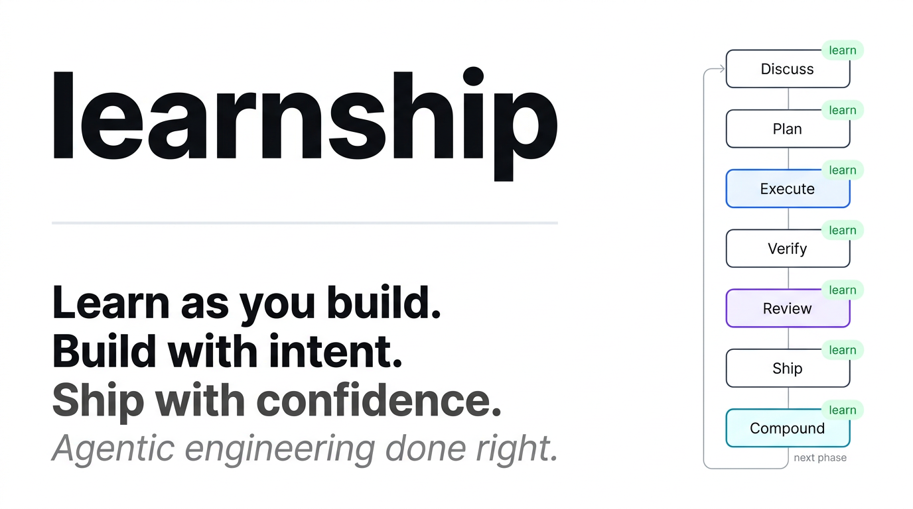

<p align="center">
  <a href="https://github.com/FavioVazquez/learnship/actions/workflows/ci.yml"></a>
  <a href="https://github.com/FavioVazquez/learnship/releases/latest"></a>
  <a href="https://faviovazquez.github.io/learnship/"></a>
  <a href="LICENSE"></a>
  <a href="https://github.com/FavioVazquez/learnship/stargazers"></a>
  <a href="https://www.npmjs.com/package/learnship"></a>
  
  
</p>

<p align="center">
  <strong>Agentic engineering done right. Learn as you build. Build with intent.</strong><br>
  <strong>A context engineering and spec-driven development system for Claude Code, Windsurf, Cursor, OpenCode, Gemini CLI, and Codex CLI.</strong>
</p>

<p align="center">
  <a href="#-install">Install</a> ·
  <a href="#-the-5-commands">5 Commands</a> ·
  <a href="#-the-phase-loop">Phase Loop</a> ·
  <a href="#-how-it-works">How It Works</a> ·
  <a href="#-workflow-reference-advanced">All Workflows</a> ·
  <a href="https://faviovazquez.github.io/learnship/">Full Docs</a> ·
  <a href="CHANGELOG.md">Changelog</a>
</p>

---

## ⚡ Install

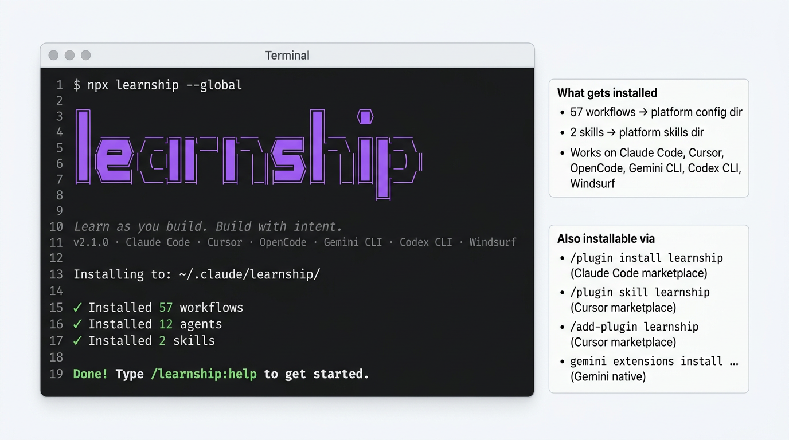

```bash
npx learnship
```

**Works on Mac, Windows, and Linux.** Requires Node.js ≥ 22 and Git. The installer auto-detects your platform.

```bash
npx learnship --global   # all projects
npx learnship --local    # this project only
npx learnship --all --global  # all 6 platforms at once
```

Then open your AI agent and type:

```
/ls
```

That's it. `/ls` tells you where you are, what to do next, and offers to run it.

<details>
<summary><strong>Platform-specific install + marketplace options</strong></summary>

| Platform | Install command | Invoke commands as |
|----------|----------------|-------------------|
| **Windsurf** | `npx learnship --windsurf --global` | `/ls`, `/new-project` |
| **Claude Code** | `npx learnship --claude --global` | `/learnship:ls`, `/learnship:new-project` |
| **Cursor** | `/add-plugin learnship` *(marketplace)* | `@learnship` rules load automatically |
| **OpenCode** | `npx learnship --opencode --global` | `/learnship-ls`, `/learnship-new-project` |
| **Gemini CLI** | `npx learnship --gemini --global` | `/learnship:ls`, `/learnship:new-project` |
| **Codex CLI** | `npx learnship --codex --global` | `$learnship-ls`, `$learnship-new-project` |

**Via marketplace (no terminal required):**

```bash
# Claude Code — community marketplace
/plugin marketplace add FavioVazquez/learnship-marketplace
/plugin install learnship@learnship-marketplace

# Cursor — after marketplace approval
/add-plugin learnship

# Gemini CLI — native extension
gemini extensions install https://github.com/FavioVazquez/learnship
```

**Custom install directory:**

```bash
npx learnship --claude --global --target /path/to/custom/dir
```

`--target` overrides the default platform directory. Works with install and uninstall on all 6 platforms.

learnship is published to npm — `npx learnship` pulls the latest release directly. No `github:` prefix, no clone needed. The same `bin/install.js` runs regardless of install method.

</details>

---

## 🗺️ The 5 Commands

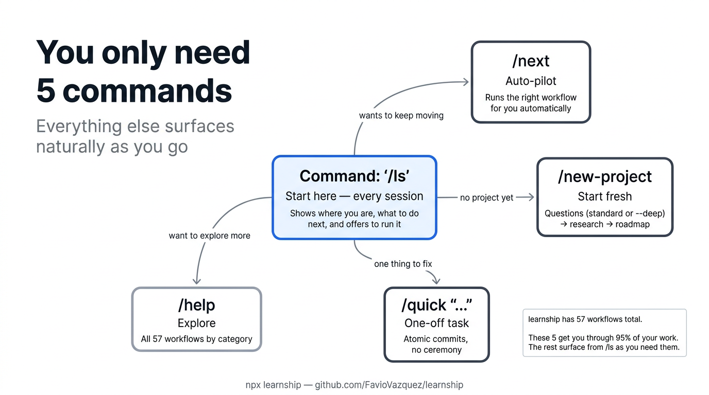

learnship has 57 workflows. You need five. Everything else surfaces naturally from `/ls`.

| Command | What it does | When to use |
|---------|-------------|-------------|
| `/ls` | Show status, recent work, and next step (and offer to run it) | **Start every session here** |
| `/next` | Read state and immediately run the right next workflow | When you just want to keep moving |
| `/new-project` | Full init: questions → research → requirements → roadmap | Starting a new project |
| `/quick "..."` | One-off task with atomic commits, no planning ceremony | Small fixes, experiments |
| `/help` | All 57 workflows organized by category | Discovering capabilities |

> **Tip:** `/ls` works for both new and returning users. No project? It explains learnship and offers `/new-project`. Returning? It shows your progress and suggests exactly what to do next.

---

## 🔄 The Phase Loop

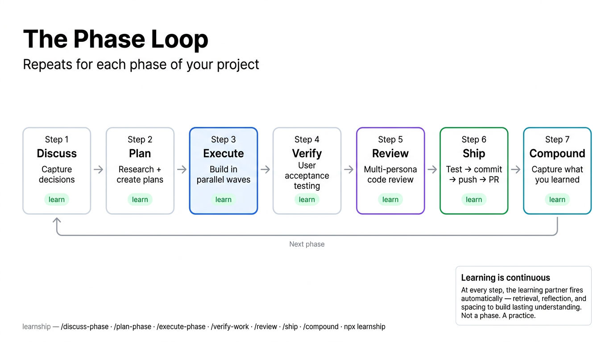

Every feature ships through a 7-step loop:

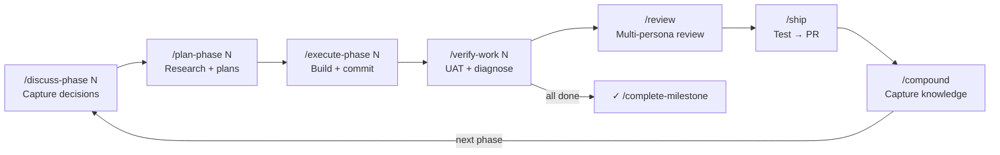

| Step | Command | What happens |
|------|---------|-------------|
| **1. Discuss** | `/discuss-phase N` | You and the agent align on implementation decisions before any code. Add `--deep` for grill-me style branch-walking (v2.3.4) |
| **2. Plan** | `/plan-phase N` | Agent researches the domain, creates vertical slice plans (tracer bullets), verifies them — including horizontal slice detection (v2.3.4) |
| **3. Execute** | `/execute-phase N` | Plans run in dependency order, one atomic commit per task |
| **4. Verify** | `/verify-work N` | You do UAT; agent diagnoses any gaps and creates fix plans |
| **5. Review** | `/review` | Multi-persona code review through 6 lenses (v2.0) |
| **6. Ship** | `/ship` | Test → lint → commit → push → PR (v2.0) |
| **7. Compound** | `/compound` | Capture what you learned as searchable documentation (v2.0) |

**Just starting?** `/ls` or `/next` will route you into the right step automatically.

---

## 🏗️ How It Works

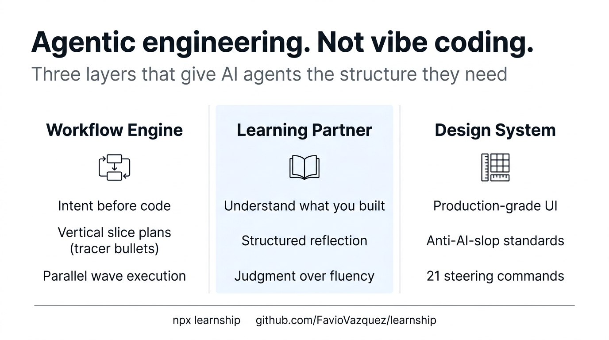

Three integrated layers that reinforce each other:

| Layer | What it does |
|-------|-------------|
| **Workflow Engine** | Spec-driven phases → context-engineered plans → wave-ordered execution → verified delivery |
| **Learning Partner** | Neuroscience-backed checkpoints at every phase transition: retrieval, reflection, spacing, struggle |
| **Design System** | 21 impeccable steering commands for production-grade UI: `/audit`, `/critique`, `/polish`, and more |

---

## 🌐 Platform Support

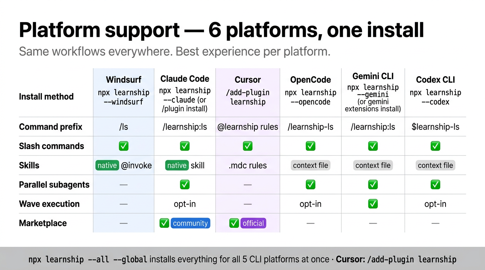

Each platform gets the best experience it supports:

| Feature | Windsurf | Claude Code | OpenCode | Gemini CLI | Codex CLI |
|---------|----------|-------------|----------|------------|-----------|
| Slash commands | ✓ | ✓ | ✓ | ✓ | `$skills` |
| Real parallel subagents | — | ✓ | ✓ | ✓ | ✓ |
| Parallel wave execution | — | ✓ opt-in | ✓ opt-in | ✓ | ✓ opt-in |
| Agent personas (17) | `model_decision` rules | `Task()` subagents | `Task()` subagents | `Task()` subagents | `Task()` subagents |
| Interactive questions | `ask_user_question` | `AskUserQuestion` | `question` | `ask_user` | `request_user_input` |
| Session hooks | — | ✓ | — | ✓ | — |
| Skills (native `@invoke`) | ✓ | — | — | — | — |
| Skills (context files) | ✓ | ✓ | ✓ | ✓ | ✓ |

**Parallel subagents:** On Claude Code, OpenCode, and Codex, `execute-phase` can spawn a dedicated executor per plan within a wave, each with its own 200k context budget. Enable with `"parallelization": { "enabled": true }` in `.planning/config.json`. Up to 5 concurrent agents per wave by default. All platforms default to sequential (always safe).

---

## What is learnship?

learnship is an **agent harness** — the scaffolding that makes your AI coding agent actually reliable across real projects.

Every serious AI coding tool converges on the same architecture: a simple execution loop wraps the model, and the **harness** decides what information reaches the model, when, and how. The model is interchangeable. The harness is the product.

learnship gives you that harness as a portable, open-source layer that adds:

- **Persistent memory.** `/new-project` generates an `AGENTS.md` loaded automatically every session. No more repeating yourself.
- **Structured process.** A repeatable phase loop with spec-driven plans, wave-ordered execution, and UAT-driven verification.
- **Knowledge compounding.** `/compound` captures solved problems. `/review` runs multi-persona code review. `/ship` runs the full delivery pipeline.
- **Security & recovery.** `/secure-phase` for STRIDE verification. `/forensics` for post-mortem. `/undo` for safe revert.
- **Session intelligence.** Hooks, context profiles, interactive questions, agent delegation. ([v2.2 details →](#whats-new-in-v22))
- **Built-in learning.** Neuroscience-backed checkpoints at every phase transition so you understand what you shipped.

---

## What problem does it solve?

If you've used AI coding assistants for more than a few sessions, you've hit this wall:

> The agent forgets everything. Each session starts from scratch. Decisions get repeated. Code quality drifts. You ship fast but understand less.

This is a **harness problem**, not a model problem. The same model scores 42% with one scaffold and 78% with another. Same model. The only variable is the harness.

learnship solves this with **progressive disclosure** — context revealed incrementally, not dumped upfront. The right files, decisions, and phase context reach the agent exactly when needed.

| Without learnship | With learnship |
|-------------------|----------------|
| Context resets every session | `AGENTS.md` loaded automatically every conversation |
| Ad-hoc prompts, unpredictable results | Spec-driven plans, verifiable deliverables |
| Architectural decisions get forgotten | `DECISIONS.md` tracked and honored by the agent |
| Everything dumped into context at once | Phase-scoped context: only what this step needs |
| You ship code you don't fully understand | Learning checkpoints build real understanding at every step |
| UI looks generic, AI-generated | `impeccable` design system prevents AI aesthetic slop |

---

## Who is it for?

**Anyone who wants to build and ship real products with AI agents** — founders, designers, researchers, makers, not just developers.

It's the right tool if:

- You're **building a real project** and want the AI to stay aligned across sessions
- You're **learning while building** and want to actually understand what gets shipped
- You care about **code quality and UI quality** beyond "it works"
- You want **parallel agent execution** on Claude Code, OpenCode, or Gemini CLI
- You've felt the frustration of **context loss**: repeating yourself while the agent forgets

It's probably overkill for one-off scripts. Use `/quick` for that.

---

## 📚 Documentation

**[faviovazquez.github.io/learnship](https://faviovazquez.github.io/learnship/)**

- **[Getting Started](https://faviovazquez.github.io/learnship/getting-started/installation/)**: install, first project, the 5 commands
- **[Platform Guide](https://faviovazquez.github.io/learnship/platform-guide/windsurf/)**: Windsurf, Claude Code, Cursor, OpenCode, Gemini CLI, Codex CLI
- **[Core Concepts](https://faviovazquez.github.io/learnship/core-concepts/phase-loop/)**: phase loop, context engineering, planning artifacts
- **[Skills](https://faviovazquez.github.io/learnship/skills/agentic-learning/)**: 11 `@agentic-learning` actions + 21 `impeccable` design commands
- **[Workflow Reference](https://faviovazquez.github.io/learnship/workflow-reference/core/)**: all 57 workflows
- **[Configuration](https://faviovazquez.github.io/learnship/configuration/)**: full schema, speed presets, parallelization

---

## 🆕 What's New

### What's new in v2.3

v2.3 adds 5 new agent personas, Windsurf-native persona adoption via `model_decision` rules, and inline `<persona_context>` blocks across all 18 persona-aware workflows:

**5 new agent personas**: `project-researcher` (domain ecosystem research for `/new-project`), `research-synthesizer` (synthesizes 4 research files into SUMMARY.md), `roadmapper` (creates phased roadmaps from requirements), `phase-researcher` (focused research for `/plan-phase` and `/research-phase`), `doc-verifier` (verifies docs match live code). Total agent pool: 17 specialist personas.

**Windsurf `model_decision` rules**: Agent personas are now installed as `.windsurf/rules/learnship-{name}.md` with `trigger: model_decision` frontmatter. Windsurf's Cascade sees the rule description in every system prompt and reads the full persona when context is relevant — the native equivalent of Claude Code's subagent spawning.

**Inline `<persona_context>` blocks**: All 18 workflows that reference agent personas now include inline persona instructions directly in the workflow text. This works on every platform — no special tool needed. Belt-and-suspenders with `@./agents/` file references and platform-native mechanisms.

**Codex sandbox map**: All 17 agent personas now have per-agent sandbox modes (`read-only` for checkers/auditors, `workspace-write` for executors/planners).

**Published agents synced**: The `agents/` directory now contains all 17 agents with proper frontmatter (`name:`, `description:`, `tools:`, `color:`) — in sync with the source `learnship/agents/` directory.

### What's new in v2.2

v2.2 adds session intelligence, structured interactivity, and research templates:

**Session hooks** (Claude Code + Gemini CLI): 4 hooks installed via `settings.json` — statusline showing context usage, context monitor that warns before context runs out, prompt guard that scans `.planning/` writes for injection patterns, and session state that injects project orientation at startup.

**Context profiles**: Set `"context": "dev"` (default), `"research"`, or `"review"` in config.json to control agent output style. Switch with `/settings`.

**Interactive questions**: 14 workflows present decisions via your platform's native structured question tool — clickable cards on Claude Code, dropdowns on Windsurf, etc. `install.js` rewrites the tool name per platform automatically.

**Agent persona delegation**: 18 workflows use inline `<persona_context>` blocks and `@./agents/` references for sequential persona adoption, with `Task()` subagent spawning when parallelization is enabled.

**Research templates**: 5 structured fill-in-the-blanks templates (STACK.md, FEATURES.md, ARCHITECTURE.md, PITFALLS.md, SUMMARY.md) that prevent the AI from skipping file writes.

**Upgrade safety**: SHA-256 file manifest after every install. Locally modified files detected and backed up before overwriting. Run `/reapply-patches` to restore customizations.

### What's new in v2.1

v2.1 adds 8 new workflows, 5 new references, 3 new templates, and 2 new agents:

| Category | New workflows |
|----------|--------------|
| **Security** | `/secure-phase` — per-phase STRIDE threat verification |
| **Documentation** | `/docs-update` — generate and verify project docs against codebase |
| **Recovery** | `/forensics` — post-mortem investigation · `/undo` — safe git revert |
| **Session** | `/note` — zero-friction capture · `/session-report` — stakeholder summaries |
| **Learning** | `/extract-learnings` — decisions, lessons, patterns, surprises · `/milestone-summary` — team onboarding |

Enhanced: `/discuss-phase` (scope guardrails + domain probes + `--deep` grill-me mode v2.3.4), `/new-project` (`--deep` questioning depth v2.3.4), `/plan-phase` (vertical slice tracer bullets + horizontal slice detection v2.3.4), `/execute-phase` (`--wave` flag + context scaling), `/quick` (`--research --validate --full` composable flags), `/ideate` (`--explore` Socratic mode).

**Optional per-phase:** `/secure-phase N` (STRIDE security), `/extract-learnings N` (meta-knowledge).
**Recovery:** `/forensics` (post-mortem), `/undo` (safe revert).

---

##  Agentic Engineering vs Vibe Coding

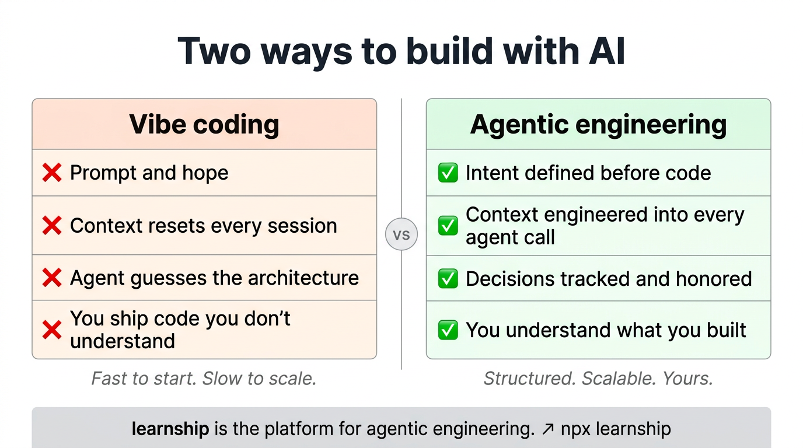

| | Vibe coding | Agentic engineering |
|-|------------|--------------------|
| **Context** | Resets every session | Engineered into every agent call |
| **Decisions** | Implicit, forgotten | Tracked in `DECISIONS.md`, honored by the agent |
| **Plans** | Ad-hoc prompts | Spec-driven, verifiable, wave-ordered |
| **Outcome** | Code you shipped | Code you shipped **and understand** |

---

## 🧠 Context Engineering

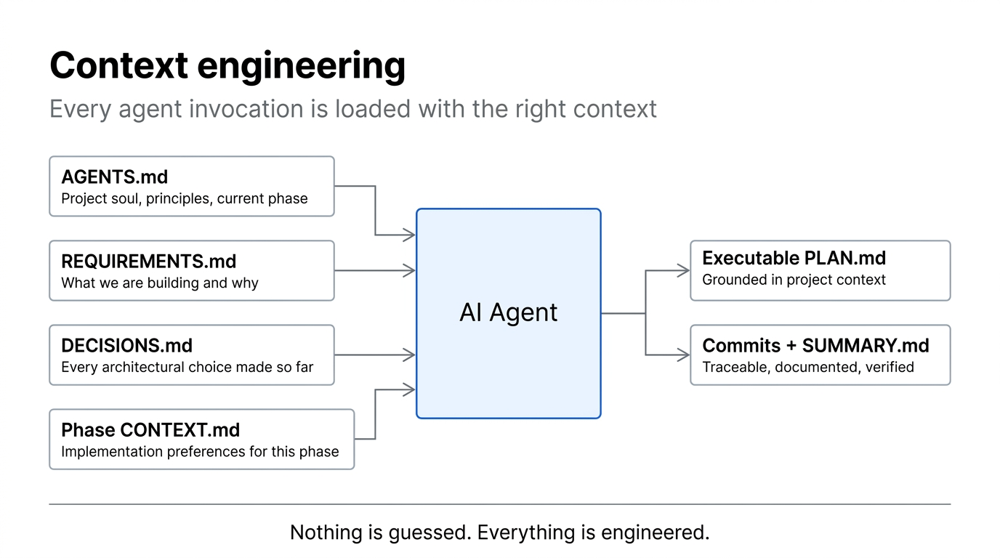

Every agent invocation is loaded with structured context. Nothing is guessed:

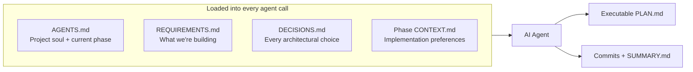

---

## 🗂️ AGENTS.md: Persistent Project Memory

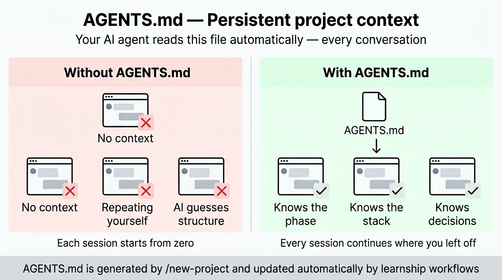

`/new-project` generates an `AGENTS.md` at your project root. On Windsurf, Claude Code, and Cursor it loads automatically every session. On other platforms, workflows reference it explicitly. Either way: the agent always knows the project, current phase, tech stack, and past decisions.

```
AGENTS.md                   ← your AI agent reads this every conversation
├── Soul & Principles        # Pair-programmer framing, 10 working principles
├── Platform Context         # Points to .planning/, explains the phase loop
├── Current Phase            # Updated automatically by workflows
├── Project Structure        # Filled during new-project from your answers
├── Tech Stack               # Filled from research results
└── Regressions              # Updated by /debug when bugs are fixed
```

---

## 📖 Workflow Reference: Advanced

> These are all 57 workflows. Most users discover them naturally from `/ls`. Scan this when you want to know if a specific capability exists.

### Core Workflow

| Workflow | Purpose | When to use |
|----------|---------|-------------|
| `/new-project` | Full init: questions → research → requirements → roadmap | Start of any new project |
| `/discuss-phase [N]` | Capture implementation decisions before planning | Before every phase |
| `/plan-phase [N]` | Research + create + verify plans | After discussing a phase |
| `/execute-phase [N]` | Wave-ordered execution of all plans | After planning |
| `/verify-work [N]` | Manual UAT with auto-diagnosis and fix planning | After execution |
| `/complete-milestone` | Archive milestone, tag release, prepare next | All phases verified |
| `/audit-milestone` | Pre-release: requirement coverage, stub detection | Before completing milestone |
| `/new-milestone [name]` | Start next version cycle | After completing a milestone |

### Navigation

| Workflow | Purpose | When to use |
|----------|---------|-------------|
| `/ls` | Status + next step + offer to run it | Start every session here |
| `/next` | Auto-pilot: reads state and runs the right workflow | When you just want to keep moving |
| `/progress` | Same as `/ls`: status overview with smart routing | "Where am I?" |
| `/resume-work` | Restore full context from last session | Starting a new session |
| `/pause-work` | Save handoff file mid-phase | Stopping mid-phase |
| `/quick [description]` | Ad-hoc task with full guarantees | Bug fixes, small features |
| `/help` | Show all available workflows | Quick command reference |

### Phase Management

| Workflow | Purpose | When to use |
|----------|---------|-------------|
| `/add-phase` | Append new phase to roadmap | Scope grows after planning |
| `/insert-phase [N]` | Insert urgent work between phases | Urgent fix mid-milestone |
| `/remove-phase [N]` | Remove future phase and renumber | Descoping a feature |
| `/research-phase [N]` | Deep research only, no plans yet | Complex/unfamiliar domain |
| `/list-phase-assumptions [N]` | Preview intended approach before planning | Validate direction |
| `/plan-milestone-gaps` | Create phases for audit gaps | After audit finds missing items |

### Brownfield, Discovery & Debugging

| Workflow | Purpose | When to use |
|----------|---------|-------------|
| `/map-codebase` | Analyze existing codebase | Before `/new-project` on existing code |
| `/discovery-phase [N]` | Map unfamiliar code area before planning | Entering complex/unfamiliar territory |
| `/debug [description]` | Systematic triage → diagnose → fix | When something breaks |
| `/diagnose-issues [N]` | Batch-diagnose all UAT issues by root cause | After verify-work finds multiple issues |
| `/execute-plan [N] [id]` | Run a single plan in isolation | Re-running a failed plan |
| `/add-todo [description]` | Capture an idea without breaking flow | Think of something mid-session |
| `/check-todos` | Review and act on captured todos | Reviewing accumulated ideas |
| `/add-tests` | Generate test coverage post-execution | After executing a phase |
| `/validate-phase [N]` | Retroactive test coverage audit | After hotfixes or legacy phases |

### Decision Intelligence

| Workflow | Purpose | When to use |
|----------|---------|-------------|
| `/decision-log [description]` | Capture decision with context and alternatives | After any significant architectural choice |
| `/knowledge-base` | Aggregate all decisions and lessons into one file | Before starting a new milestone |
| `/knowledge-base search [query]` | Search the project knowledge base | When you need to recall why something was built a certain way |

### Milestone Intelligence

| Workflow | Purpose | When to use |
|----------|---------|-------------|
| `/discuss-milestone [version]` | Capture goals, anti-goals before planning | Before `/new-milestone` |
| `/milestone-retrospective` | 5-question retrospective + spaced review | After `/complete-milestone` |
| `/transition` | Write full handoff document for new session/collaborator | Before handing off or long break |

### Compounding & Quality (v2.0)

| Workflow | Purpose | When to use |
|----------|---------|-------------|
| `/compound` | Capture solved problem as searchable documentation | After `/debug`, `/verify-work`, or any aha moment |
| `/review` | Multi-persona code review (6 lenses) | After `/verify-work`, before shipping |
| `/challenge` | Stress-test scope through product + engineering lenses | Before committing to a milestone or large feature |
| `/ship` | Test → lint → commit → push → PR | After review, ready to deploy |
| `/ideate` | Codebase-grounded idea generation | Before `/discuss-milestone`, between milestones |
| `/guard` | Safety mode: protect sensitive directories | Working on auth, payments, migrations |
| `/sync-docs` | Detect stale documentation | Before `/complete-milestone`, after refactors |

### Maintenance

| Workflow | Purpose | When to use |
|----------|---------|-------------|
| `/settings` | Interactive config editor | Change mode, toggle agents |
| `/set-profile [quality\|balanced\|budget]` | One-step model profile switch | Quick cost/quality adjustment |
| `/health` | Project health check | Stale files, missing artifacts |
| `/cleanup` | Archive old artifacts | End of milestone |
| `/update` | Update the platform itself | Check for new workflows |
| `/reapply-patches` | Restore local edits after update | After `/update` if you had local changes |

---

## ⚙️ Configuration

Project settings live in `.planning/config.json`. Set during `/new-project` or edit with `/settings`.

### Full Schema

```json
{
  "mode": "interactive",
  "granularity": "standard",
  "model_profile": "balanced",
  "learning_mode": "auto",
  "context": "dev",
  "test_first": false,
  "planning": {
    "commit_docs": true,
    "commit_mode": "auto",
    "search_gitignored": false
  },
  "workflow": {
    "research": true,
    "plan_check": true,
    "verifier": true,
    "validation": true,
    "review": true,
    "solutions_search": true,
    "security_enforcement": true,
    "discuss_mode": "discuss",
    "tdd_mode": false
  },
  "parallelization": {
    "enabled": false,
    "plan_level": true,
    "task_level": false,
    "max_concurrent_agents": 5,
    "min_plans_for_parallel": 2
  },
  "gates": {
    "confirm_project": true,
    "confirm_phases": true,
    "confirm_roadmap": true,
    "confirm_plan": true,
    "execute_next_plan": true,
    "issues_review": true,
    "confirm_transition": true
  },
  "safety": {
    "always_confirm_destructive": true,
    "always_confirm_external_services": true
  },
  "review": {
    "auto_after_verify": false
  },
  "ship": {
    "auto_test": true,
    "conventional_commits": true,
    "pr_template": true
  },
  "hooks": {
    "context_warnings": true
  },
  "git": {
    "branching_strategy": "none",
    "phase_branch_template": "phase-{phase}-{slug}",
    "milestone_branch_template": "{milestone}-{slug}"
  }
}
```

### Core Settings

| Setting | Options | Default | What it controls |
|---------|---------|---------|-----------------|
| `mode` | `auto`, `interactive` | `auto` | `auto` auto-approves steps; `interactive` confirms at each decision |
| `granularity` | `coarse`, `standard`, `fine` | `standard` | Phase size: 3-5 / 5-8 / 8-12 phases |
| `model_profile` | `quality`, `balanced`, `budget` | `balanced` | Agent model tier (see table below) |
| `learning_mode` | `auto`, `manual` | `auto` | `auto` offers learning at checkpoints; `manual` requires explicit invocation |
| `context` | `dev`, `research`, `review` | `dev` | Output profile: `dev` (concise), `research` (detailed), `review` (audit-focused) |
| `parallelization.enabled` | `true`, `false` | `false` | Parallel subagents per plan on supported platforms |
| `test_first` | `true`, `false` | `false` | TDD mode: write failing test first, verify red, implement, verify green |
| `planning.commit_mode` | `auto`, `manual` | `auto` | `auto` commits after each workflow step; `manual` skips all git commits |

### Workflow Toggles

| Setting | Default | What it controls |
|---------|---------|-----------------|
| `workflow.research` | `true` | Domain research before planning each phase |
| `workflow.plan_check` | `true` | Plan verification loop (up to 3 iterations) |
| `workflow.verifier` | `true` | Post-execution verification against phase goals |
| `workflow.validation` | `true` | Test coverage mapping during plan-phase |
| `workflow.review` | `true` | Enable `/review` suggestions after `/verify-work` (v2.0) |
| `workflow.solutions_search` | `true` | Search `.planning/solutions/` during `/plan-phase` (v2.0) |

### Review & Ship Settings

| Setting | Default | What it controls |
|---------|---------|------------------|
| `review.auto_after_verify` | `false` | Auto-run `/review` after `/verify-work` passes |
| `ship.auto_test` | `true` | Run test suite before shipping |
| `ship.conventional_commits` | `true` | Use conventional commit format |
| `ship.pr_template` | `true` | Auto-generate PR description |

### Git Branching

| `branching_strategy` | Creates branch | Best for |
|---------------------|---------------|---------|
| `none` | Never | Solo dev, simple projects |
| `phase` | At each `execute-phase` | Code review per phase |
| `milestone` | At first `execute-phase` | Release branches, PR per version |

### Model Profiles

| Agent | `quality` | `balanced` | `budget` |
|-------|-----------|------------|----------|
| Planner | large | large | medium |
| Executor | large | medium | medium |
| Phase Researcher | large | medium | small |
| Debugger | large | medium | medium |
| Verifier | medium | medium | small |
| Plan Checker | medium | medium | small |
| Solution Writer | medium | medium | small |
| Code Reviewer | large | medium | medium |
| Challenger | large | medium | medium |
| Ideation Agent | large | medium | small |

> **Platform note:** Tiers map to the best available model on your platform: `large` = Claude Opus 4.6 / Gemini 3.1 Pro / GPT-5.4, `medium` = Claude Sonnet 4.6 / Gemini 3.1 Flash / GPT-5.4-mini, `small` = Claude Haiku 4.5 / Gemini 3.1 Flash-Lite / GPT-5.4-nano. Windsurf, Cursor, and OpenCode use the platform default model — tiers signal intended task complexity.

### Speed vs. Quality Presets

| Scenario | `mode` | `granularity` | `model_profile` | Research | Plan Check | Verifier |
|----------|--------|--------------|----------------|----------|------------|---------|
| Prototyping | `auto` | `coarse` | `budget` | off | off | off |
| Normal dev | `auto` | `standard` | `balanced` | on | on | on |
| Production | `interactive` | `fine` | `quality` | on | on | on |

---

## 🧩 Learning Partner

The learning partner is woven into the platform, not bolted on. It fires at natural workflow transitions to build genuine understanding, not just fluent answers.

### How it fires

```
learning_mode: "auto"    → offered automatically at checkpoints (default)
learning_mode: "manual"  → only when you explicitly invoke @agentic-learning
```

### All 11 actions

| Action | Trigger | What it does |
|--------|---------|-------------|
| `@agentic-learning learn [topic]` | Any time | Active retrieval: explain before seeing, then fill gaps |
| `@agentic-learning quiz [topic]` | Any time | 3-5 questions, one at a time, formative feedback |
| `@agentic-learning reflect` | After `execute-phase` | Three-question structured reflection: learned / goal / gaps |
| `@agentic-learning space` | After `verify-work` | Schedule concepts for spaced review → writes `docs/revisit.md` |
| `@agentic-learning brainstorm [topic]` | After `new-project` | Collaborative design dialogue before any code |
| `@agentic-learning struggle [topic]` | During `quick` | Hint ladder: try first, reveal only when needed |
| `@agentic-learning either-or` | After `discuss-phase` | Decision journal: paths considered, choice, rationale |
| `@agentic-learning explain-first` | Any time | Oracy exercise: you explain, agent gives structured feedback |
| `@agentic-learning explain [topic]` | Any time | Project comprehension log → writes `docs/project-knowledge.md` |
| `@agentic-learning interleave` | Any time | Mixed retrieval across multiple topics |
| `@agentic-learning cognitive-load [topic]` | After `plan-phase` | Decompose overwhelming scope into working-memory steps |

**Core principle:** Fluent answers from an AI are not the same as learning. Every action makes you do the cognitive work, with support rather than shortcuts.

### Skills across platforms

| Platform | How `agentic-learning` works |
|----------|-----------------------------|
| **Windsurf** | Native skill: invoke with `@agentic-learning learn`, `@agentic-learning quiz`, etc. |
| **Claude Code, OpenCode, Gemini CLI, Codex CLI** | Installed as a context file in `learnship/skills/agentic-learning/`. The AI reads and applies the techniques automatically. Reference it explicitly with `use the agentic-learning skill` or just work normally and it activates at checkpoints. |

---

## 🎨 Design System

The **impeccable** skill suite is always active as project context for any UI work. It provides design direction, anti-patterns, and 21 steering commands that prevent generic AI aesthetics. Based on [@pbakaus/impeccable](https://github.com/pbakaus/impeccable).

### Commands

| Command | What it does |
|---------|-------------|
| `/teach-impeccable` | One-time setup: gathers project design context and saves persistent guidelines |
| `/audit` | Comprehensive audit: accessibility, performance, theming, responsive design |
| `/critique` | UX critique: visual hierarchy, information architecture, emotional resonance |
| `/polish` | Final quality pass: alignment, spacing, consistency before shipping |
| `/normalize` | Normalize design to match your design system for consistency |
| `/colorize` | Add strategic color to monochromatic or flat interfaces |
| `/animate` | Add purposeful animations and micro-interactions |
| `/bolder` | Amplify safe or boring designs for more visual impact |
| `/quieter` | Tone down overly aggressive designs to reduce intensity and gain refinement |
| `/distill` | Strip to essence: remove complexity, clarify what matters |
| `/clarify` | Improve UX copy, error messages, microcopy, labels |
| `/optimize` | Performance: loading speed, rendering, animations, bundle size |
| `/harden` | Resilience: error handling, i18n, text overflow, edge cases |
| `/delight` | Add moments of joy and personality that make interfaces memorable |
| `/extract` | Extract reusable components and design tokens into your design system |
| `/adapt` | Adapt designs across screen sizes, devices, and contexts |
| `/onboard` | Design onboarding flows, empty states, first-time user experiences |

**The AI Slop Test:** If you showed the interface to someone and said "AI made this", would they believe you immediately? If yes, that's the problem. Use `/critique` to find out.

### learnship integration

**Automatic UI standards during `execute-phase`:** When a phase involves UI work, learnship detects it automatically and activates `@impeccable frontend-design` principles before any code is written. You'll see a banner announcing it. The agent then applies typography, color, layout, and component standards across every task in the phase — not as a post-hoc review but as an active constraint during execution.

**Post-action milestone recommendation:** After any impeccable action produces recommendations, the agent suggests running `/new-milestone` to create a dedicated "UI Polish" milestone. This turns impeccable findings into versioned, traceable phases with plans and commits — so improvements don't disappear into chat history. Applying directly is always an option too.

### Skills across platforms

| Platform | How `impeccable` works |
|----------|-----------------------|
| **Windsurf** | Native skills: invoke each command directly with `/audit`, `/polish`, `/critique`, etc. |
| **Claude Code, OpenCode, Gemini CLI, Codex CLI** | Installed as context files in `learnship/skills/impeccable/`. The AI reads design principles and anti-patterns automatically. Reference commands explicitly with `run the /audit impeccable skill` or just ask for UI work and it applies the standards. |

---

## 💡 Usage Examples

### New greenfield project

```
/new-project              # Answer questions, configure, approve roadmap
/discuss-phase 1          # Lock in your implementation preferences
/plan-phase 1             # Research + plan + verify
/execute-phase 1          # Wave-ordered execution
/verify-work 1            # Manual UAT
/review                   # v2.0: multi-persona code review
/ship                     # v2.0: test → commit → push → PR
/compound                 # v2.0: capture what you learned
                          # Repeat for each phase
/sync-docs                # v2.0: detect stale documentation
/audit-milestone          # Check everything shipped
/complete-milestone       # Archive, tag, done
```

### Existing codebase (brownfield)

```
/map-codebase             # Structured codebase analysis
/new-project              # Questions focus on what you're ADDING
# Normal phase workflow from here
```

### Quick bug fix

```
/quick "Fix login button not responding on mobile Safari"
```

### Quick with discussion + verification

```
/quick --discuss --full "Add dark mode toggle"
```

### Resuming after a break

```
/ls                       # See where you left off (offers to run next step)
# or
/next                     # Just pick up and go: auto-pilot
# or
/resume-work              # Full context restoration
```

### Scope change mid-milestone

```
/add-phase                # Append new phase to roadmap
/insert-phase 3           # Insert urgent work between phases 3 and 4
/remove-phase 7           # Descope phase 7 and renumber
```

### Preparing for release

```
/audit-milestone          # Check requirement coverage, detect stubs
/plan-milestone-gaps      # If audit found gaps, create phases to close them
/complete-milestone       # Archive, tag, done
```

### Debugging something broken

```
/debug "Login flow fails after password reset"
```

---

## 🧭 Decision Intelligence

Every project accumulates decisions: architecture choices, library picks, scope trade-offs. The platform tracks them in a structured register so future sessions understand *why* the project is built the way it is.

**`.planning/DECISIONS.md`** is the decision register:
```markdown
## DEC-001: Use Zustand over Redux
Date: 2026-03-01 | Phase: 2 | Type: library
Context: Needed client-side state for dashboard filters
Options: Zustand (simple, no boilerplate), Redux (complex, overkill for scope)
Choice: Zustand
Rationale: 3x less boilerplate, sufficient for current data flow complexity
Consequences: Locks React as UI framework; migration would require state rewrite
Status: active
```

**Populated automatically by:**
- `discuss-phase` surfaces prior decisions before each phase discussion
- `plan-phase` reads decisions before creating plans (never contradicts active ones)
- `debug` puts architectural lessons from bugs into the register
- `decision-log` manually captures any decision from any conversation

**Queried by:**
- `audit-milestone` checks decisions were honored in implementation
- `knowledge-base` aggregates all decisions into a searchable `KNOWLEDGE.md`

---

## 📁 Planning Artifacts

Every project creates a structured `.planning/` directory:

```
.planning/
├── config.json               # Workflow settings
├── PROJECT.md                # Vision, requirements, key decisions
├── REQUIREMENTS.md           # v1 requirements with REQ-IDs
├── ROADMAP.md                # Phase breakdown with status tracking
├── STATE.md                  # Current position, decisions, blockers
├── DECISIONS.md              # Cross-phase decision register
├── KNOWLEDGE.md              # Aggregated lessons (from knowledge-base)
├── research/                 # Domain research from new-project
│   ├── STACK.md
│   ├── FEATURES.md
│   ├── ARCHITECTURE.md
│   ├── PITFALLS.md
│   └── SUMMARY.md
├── codebase/                 # Brownfield mapping (from map-codebase)
│   ├── STACK.md
│   ├── ARCHITECTURE.md
│   ├── CONVENTIONS.md
│   └── CONCERNS.md
├── todos/
│   ├── pending/              # Captured ideas awaiting work
│   └── done/                 # Completed todos
├── solutions/               # Knowledge compounding (from /compound) (v2.0)
│   ├── auth/                # Solutions by category
│   ├── performance/
│   └── ...
├── debug/                    # Active debug sessions
│   └── resolved/             # Archived debug sessions
├── quick/
│   └── 001-slug/             # Quick task artifacts
│       ├── 001-PLAN.md
│       ├── 001-SUMMARY.md
│       └── 001-VERIFICATION.md (if --full)
└── phases/
    └── 01-phase-name/
        ├── 01-CONTEXT.md     # Your implementation preferences
        ├── 01-DISCOVERY.md   # Unfamiliar area mapping (from discovery-phase)
        ├── 01-RESEARCH.md    # Ecosystem research findings
        ├── 01-VALIDATION.md  # Test coverage contract (from /validate-phase)
        ├── 01-01-PLAN.md     # Executable plan (wave 1)
        ├── 01-02-PLAN.md     # Executable plan (wave 1, independent)
        ├── 01-01-SUMMARY.md  # Execution outcomes
        ├── 01-UAT.md         # User acceptance test results
        └── 01-VERIFICATION.md # Post-execution verification
```

---

## 🔧 Troubleshooting

### "Project already initialized"
`/new-project` found `.planning/PROJECT.md` already exists. If you want to start over, delete `.planning/` first. To continue, use `/progress` or `/resume-work`.

### Context degradation during long sessions
Start each major workflow with a fresh context. The platform is designed around fresh context windows; every agent gets a clean slate. Use `/resume-work` or `/progress` to restore state after clearing.

### Plans seem wrong or misaligned
Run `/discuss-phase [N]` before planning. Most plan quality issues come from unresolved gray areas. Run `/list-phase-assumptions [N]` to see the intended approach before committing to a plan.

### Execution produces stubs or incomplete code
Plans with more than 3 tasks are too large for reliable single-context execution. Re-plan with smaller scope: `/plan-phase [N]` with finer granularity.

### Lost track of where you are
Run `/ls`. It reads all state files, shows your progress, and offers to run the next step.

### Need to change something after execution
Use `/quick` for targeted fixes, or `/verify-work` to systematically identify and fix issues through UAT. Do not re-run `/execute-phase` on a phase that already has summaries.

### Costs running too high
Switch to budget profile via `/settings`. Disable research and plan-check for familiar domains. Use `granularity: "coarse"` for fewer, broader phases.

### Working on a private/sensitive project
Set `commit_docs: false` during `/new-project` or via `/settings`. Add `.planning/` to `.gitignore`. Planning artifacts stay local.

### Something broke and I don't know why
Run `/debug "description of what's broken"`. It runs triage → root cause diagnosis → fix planning with a persistent debug session.

### Phase passed UAT but has known gaps
Run `/audit-milestone` to surface all gaps, then `/plan-milestone-gaps` to create fix phases before release.

---

## 🚑 Recovery Quick Reference

| Problem | Solution |
|---------|----------|
| Lost context / new session | `/ls` or `/next` |
| Phase went wrong | `git revert` the phase commits, re-plan |
| Need to change scope | `/add-phase`, `/insert-phase`, or `/remove-phase` |
| Milestone audit found gaps | `/plan-milestone-gaps` |
| Something broke | `/debug "description"` |
| Quick targeted fix | `/quick` |
| Plans don't match your vision | `/discuss-phase [N]` then re-plan |
| Costs running high | `/settings` → budget profile, toggle agents off |

---

## 📂 Repository Structure

```
learnship/
├── .windsurf/
│   ├── workflows/          # 57 workflows as slash commands
│   ├── rules/              # 17 model_decision rules (agent personas for Windsurf)
│   └── skills/
│       ├── agentic-learning/   # Learning partner (SKILL.md + references), native on Windsurf + Claude Code
│       └── impeccable/         # Design suite: 21 skills, native on Windsurf + Claude Code
│           ├── frontend-design/ #   Base skill + 7 reference files (typography, color, motion…)
│           ├── audit/           #   /audit
│           ├── critique/        #   /critique
│           ├── polish/          #   /polish
│           └── …14 more/        #   /colorize /animate /bolder /quieter /distill /clarify…
│                               # → on OpenCode/Gemini/Codex: both skills copied to learnship/skills/ as context files
├── commands/               # 57 Claude Code-style slash command wrappers
│   └── learnship/          # /learnship:ls, /learnship:new-project, etc.
├── learnship/              # Payload installed into the target platform config dir
│   ├── workflows/          # 57 workflow markdown files (the actual instructions)
│   ├── references/         # Reference docs (questioning, verification, git, design, learning)
│   └── templates/          # Document templates for .planning/ + AGENTS.md template
├── agents/                 # 17 agent personas (planner, researcher, project-researcher, research-synthesizer, phase-researcher, roadmapper, executor, verifier, debugger, plan-checker, solution-writer, code-reviewer, challenger, ideation-agent, security-auditor, doc-writer, doc-verifier)
├── assets/                 # Brand images (banner, explainers, diagrams)
├── bin/
│   └── install.js          # Multi-platform installer (Claude Code, OpenCode, Gemini CLI, Codex CLI, Windsurf)
├── tests/
│   └── run_all.sh               # 15 test suites, 1200+ checks across 6 platforms
├── SKILL.md                # Meta-skill: platform context loaded by Cascade / AI agents
├── install.sh              # Shell installer wrapper
├── package.json            # npm package (npx learnship)
├── CHANGELOG.md            # Version history
└── CONTRIBUTING.md         # How to extend the platform
```

---

## 🙏 Inspiration & Credits

**learnship** builds on ideas and work from these open-source projects:

- **[get-shit-done](https://github.com/gsd-build/get-shit-done)**: spec-driven development with structured workflows and planning artifacts — no sprint ceremonies, just build
- **[agentic-learning](https://github.com/FavioVazquez/agentic-learning)**: neuroscience-backed learning techniques woven into the development cycle
- **[impeccable](https://github.com/pbakaus/impeccable)**: frontend design quality system with auditing and refinement actions
- **[compound-engineering](https://github.com/EveryInc/compound-engineering-plugin)**: the philosophy that each unit of engineering work should make subsequent units easier — compounding knowledge through structured review and documentation
- **[superpowers](https://github.com/obra/superpowers)**: complete development workflow for coding agents with subagent-driven execution, TDD enforcement, and plan-based task dispatching
- **[gstack](https://github.com/nichochar/gstack)**: builder-first engineering system with safety guards, shipping pipelines, multi-specialist review, and the "Boil the Lake" philosophy of AI-assisted completeness

learnship adapts, combines, and extends these into a unified, multi-platform system with integrated learning. All are used as inspiration and learnship is original work built on their shoulders.

---

## License

MIT © [Favio Vazquez](https://github.com/FavioVazquez)
