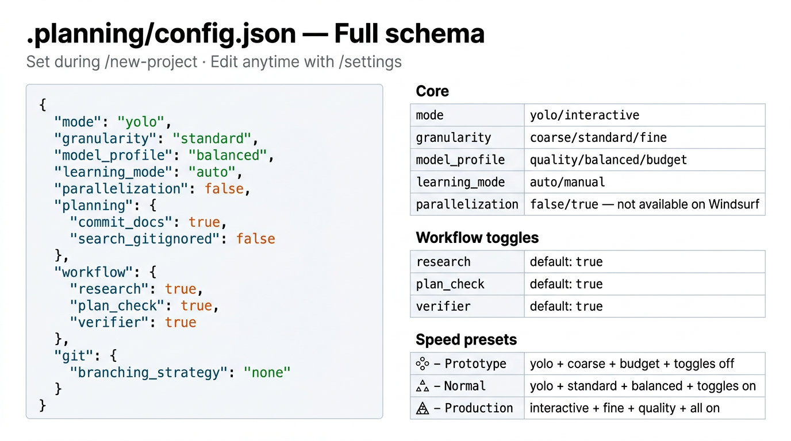

# Configuration



Project settings live in `.planning/config.json`. Set during `/new-project` or edit interactively with `/settings`.

## Full schema

```json title=".planning/config.json"
{
  "mode": "yolo",
  "granularity": "standard",
  "model_profile": "balanced",
  "learning_mode": "auto",
  "parallelization": false,
  "planning": {
    "commit_docs": true,
    "search_gitignored": false
  },
  "workflow": {
    "research": true,
    "plan_check": true,
    "verifier": true,
    "nyquist_validation": true
  },
  "git": {
    "branching_strategy": "none",
    "phase_branch_template": "phase-{phase}-{slug}",
    "milestone_branch_template": "{milestone}-{slug}"
  }
}
```

---

## Core settings

### `mode`

Controls how much the agent auto-approves vs. asks for confirmation.

| Value | Behavior |
|-------|----------|
| `"yolo"` | Agent auto-approves intermediate steps. Faster. Default. |
| `"interactive"` | Agent pauses at each decision point and waits for your explicit approval. Safer for production work. |

### `granularity`

Controls the size of phases in the roadmap.

| Value | Phases per milestone | Best for |
|-------|---------------------|---------|
| `"coarse"` | 3–5 | Prototyping, familiar domains |
| `"standard"` | 5–8 | Normal development. Default. |
| `"fine"` | 8–12 | Production-grade, complex systems |

### `model_profile`

Sets the tier of AI model used per agent role.

| Profile | Planner | Executor | Researcher | Verifier |
|---------|---------|---------|-----------|---------|
| `"quality"` | large | large | large | medium |
| `"balanced"` | large | medium | medium | medium |
| `"budget"` | medium | medium | small | small |

> `large` = Claude Opus / Gemini 2.5 Pro / GPT-4o  
> `medium` = Claude Sonnet / Gemini 2.0 Flash  
> `small` = Claude Haiku / Gemini Flash Lite  
> Exact model depends on your platform.

Switch quickly: `/set-profile quality` · `/set-profile balanced` · `/set-profile budget`

### `learning_mode`

| Value | Behavior |
|-------|----------|
| `"auto"` | Learning checkpoints offered automatically at phase transitions. Default. |
| `"manual"` | Checkpoints are quiet — invoke `@agentic-learning` explicitly when you want it. |

### `parallelization`

| Value | Behavior |
|-------|----------|
| `false` | Sequential execution. Always safe. Default. |
| `true` | Parallel subagents on Claude Code, OpenCode, Gemini CLI, Codex CLI. Each plan gets its own 200k context. |

---

## Planning settings

### `planning.commit_docs`

| Value | Behavior |
|-------|----------|
| `true` | Planning artifacts (`.planning/`) are committed to git. Default. |
| `false` | Artifacts stay local. Add `.planning/` to `.gitignore`. |

### `planning.search_gitignored`

| Value | Behavior |
|-------|----------|
| `false` | Agent respects `.gitignore` during codebase searches. Default. |
| `true` | Agent searches all files including gitignored ones. |

---

## Workflow toggles

| Toggle | Default | What it controls |
|--------|---------|-----------------|
| `workflow.research` | `true` | Domain research before planning each phase. Turn off for familiar domains to save tokens. |
| `workflow.plan_check` | `true` | Verification loop (up to 3 passes) after plans are created. Turn off for quick iterations. |
| `workflow.verifier` | `true` | Post-execution verification against phase goals. |
| `workflow.nyquist_validation` | `true` | Test coverage mapping during plan-phase. Ensures testable acceptance criteria. |

---

## Git branching

| Strategy | Creates branch | Best for |
|----------|---------------|---------|
| `"none"` | Never | Solo dev, simple projects. Default. |
| `"phase"` | At each `execute-phase` | Code review per phase |
| `"milestone"` | At first `execute-phase` | Release branches, PR per version |

```json
"git": {
  "branching_strategy": "phase",
  "phase_branch_template": "phase-{phase}-{slug}"
}
```

Template variables: `{phase}` = phase number, `{slug}` = kebab-case phase name, `{milestone}` = milestone version.

---

## Speed vs. quality presets

| Scenario | `mode` | `granularity` | `model_profile` | Toggles |
|----------|--------|--------------|----------------|---------|
| Prototype / spike | `yolo` | `coarse` | `budget` | research: off, plan_check: off |
| Normal development | `yolo` | `standard` | `balanced` | all on |
| Production / client | `interactive` | `fine` | `quality` | all on |

Apply a preset with `/settings` or edit `config.json` directly. The `/set-profile` command switches `model_profile` only — for full preset changes use `/settings`.

---

## Editing settings

**Interactive editor:**
```
/settings
```

**One-step model switch:**
```
/set-profile quality
/set-profile balanced
/set-profile budget
```

**Direct edit:** Open `.planning/config.json` in your editor — changes take effect immediately on the next workflow run.
