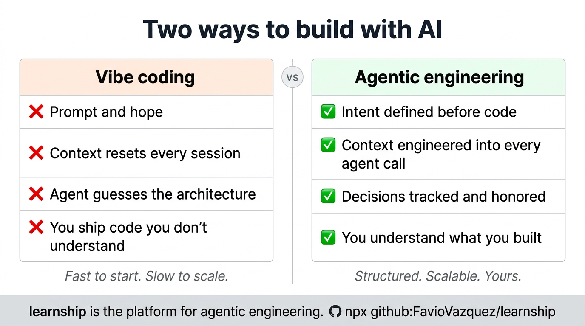

# Agentic Engineering vs Vibe Coding



There are two ways to build with AI. One feels faster at the start. One actually is faster overall.

---

## The vibe coding pattern

```
You: "Build me a login page"
AI:  [generates something]
You: "Add dark mode"
AI:  [generates something, breaks the previous thing]
You: "Fix what you broke"
AI:  [generates a fix, introduces a new inconsistency]
```

This pattern has a ceiling. It works for demos and throwaway code. It breaks down the moment you need the AI to:

- Remember a decision made three sessions ago
- Understand why the architecture is the way it is
- Build on top of code it didn't write
- Produce something production-grade

The AI isn't failing — it has no context. It's solving a different problem than the one you think you're solving.

---

## The agentic engineering pattern

```
/discuss-phase N    → you and the agent align on decisions before code
/plan-phase N       → agent creates grounded, verifiable plans
/execute-phase N    → agent executes with full context, atomic commits
/verify-work N      → you test, agent diagnoses, fixes are targeted
```

Each step in this pattern adds structured context that flows into the next. By the time the executor agent runs, it knows:

- What you're building (from `AGENTS.md`)
- What decisions have been made (from `DECISIONS.md`)
- What your preferences are for this phase (from `CONTEXT.md`)
- What has already been built (from prior `SUMMARY.md` files)

Nothing is guessed. Everything is engineered.

---

## Side by side

| | Vibe coding | Agentic engineering |
|-|------------|---------------------|
| **Context** | Resets every session | Engineered into every agent call |
| **Decisions** | Implicit, forgotten | Tracked in `DECISIONS.md`, honored by the agent |
| **Plans** | Ad-hoc prompts | Spec-driven, verifiable, wave-ordered |
| **Regressions** | Frequent, hard to trace | Logged in `AGENTS.md`, patterns detected |
| **Understanding** | "I shipped it" | "I shipped it and I know why it works" |
| **Scale** | Falls apart at complexity | Designed for multi-phase, multi-session projects |

---

## The learning dimension

The other failure mode of vibe coding: you ship code you don't understand. The AI wrote it; you reviewed it; it works. But six months later, when it breaks, you have no model for why.

learnship treats this as a first-class problem. The [Learning Partner](../skills/agentic-learning.md) fires at every phase transition to build genuine understanding — not just fluent answers.

```
After execute-phase:   @agentic-learning reflect  (what did I actually learn?)
After verify-work:     @agentic-learning space    (schedule for retention)
After debug:           @agentic-learning learn    (turn the bug into a pattern)
After plan-phase:      @agentic-learning explain-first (can I explain the approach?)
```

The goal isn't to slow you down. It's to ensure that when you finish a milestone, you own the code — not just the repo.

---

## When to use learnship

learnship is the right tool when you're building something that:

- Has more than one phase of work
- Will need to be maintained or extended later
- Involves decisions you'll want to remember
- Has quality standards (production, client-facing, team code)

For a quick throwaway script or experiment, `/quick` is sufficient — same guarantees, no phase planning ceremony.
