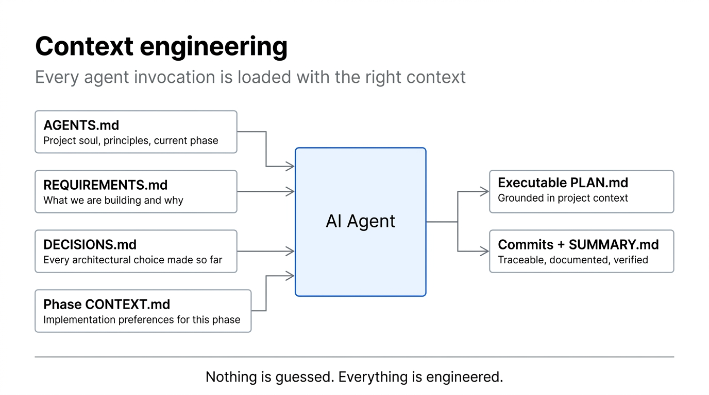
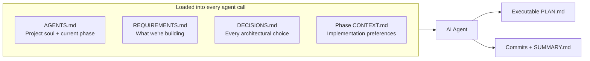
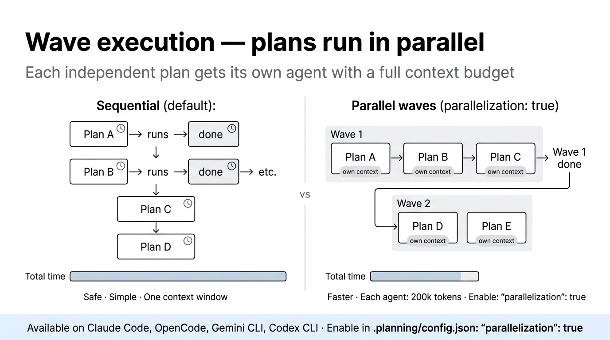

# Context Engineering



The difference between a good AI agent output and a mediocre one is almost always **context quality**. learnship doesn't let agents guess — every invocation is loaded with the right structured context for what it needs to do.

---

## The problem with raw AI agents

Without structured context, every AI session starts cold:

- The agent doesn't know your tech stack
- It doesn't know what decisions you've already made
- It doesn't know which phase you're in or what was built before
- It makes assumptions — and those assumptions become bugs

The naive fix (pasting context manually at the start of every session) is fragile, inconsistent, and exhausting.

---

## How learnship solves it



### AGENTS.md — persistent project memory

Generated by `/new-project` and placed at your **project root**. Your AI platform reads it as a system rule at the start of every conversation — automatically, without any action from you.

```
AGENTS.md
├── Soul & Principles        # Pair-programmer framing, 10 working principles
├── Platform Context         # Points to .planning/, explains the phase loop
├── Current Phase            # Updated automatically by workflows
├── Project Structure        # Filled from your new-project answers
├── Tech Stack               # Filled from domain research
└── Regressions              # Updated by /debug when bugs are fixed
```

Every workflow updates `AGENTS.md` when the phase advances — so the agent always knows where the project stands.

### DECISIONS.md — the decision register

```markdown title=".planning/DECISIONS.md"
## DEC-001: Use Zustand over Redux
Date: 2026-03-01 | Phase: 2 | Type: library
Context: Needed client-side state for dashboard filters
Options: Zustand (simple), Redux (complex, overkill for scope)
Choice: Zustand
Rationale: 3x less boilerplate, sufficient for current data flow
Consequences: Locks React as UI framework
Status: active
```

The planner reads `DECISIONS.md` before creating any plans and never contradicts active decisions. The debugger adds lessons from bugs. `/audit-milestone` checks that decisions were honored.

### Phase CONTEXT.md — your preferences per phase

Before planning, `/discuss-phase` writes your implementation preferences to `.planning/phases/N-*/N-CONTEXT.md`. The planner reads this and creates plans that match your choices — not generic best practices.

---

## Parallel execution with full context budgets



On Claude Code, OpenCode, Gemini CLI, and Codex CLI, you can enable parallel subagents:

```json title=".planning/config.json"
{ "parallelization": true }
```

When enabled, `execute-phase` dispatches each independent plan to its own dedicated executor agent — each with a full 200k token context budget. Plans in the same wave run in parallel.

| Mode | Context per agent | Speed |
|------|-----------------|-------|
| Sequential (default) | Shared | Safe, predictable |
| Parallel (`parallelization: true`) | 200k each | Faster, more thorough |

!!! note "Windsurf"
    Windsurf doesn't support real parallel subagents — execution is always sequential. All other capabilities are identical.

---

## What "nothing is guessed" means in practice

| Without context engineering | With learnship |
|-----------------------------|----------------|
| Agent picks a random auth library | Agent uses the one you chose in `CONTEXT.md` |
| Agent forgets decisions made 3 sessions ago | Agent reads `DECISIONS.md` — every decision is live |
| Agent creates plans that conflict with your architecture | Planner reads `AGENTS.md` and the decision register |
| Plans break in later phases | Planner sees `REQUIREMENTS.md` and REQ-IDs |
