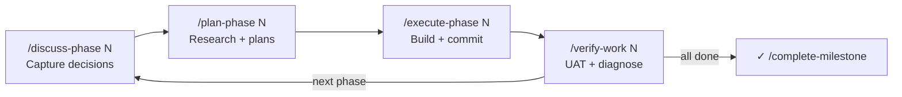
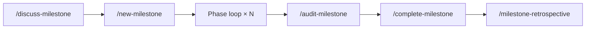

# The Phase Loop


Every feature in learnship ships through the same four-step loop. The loop repeats for each phase of your project until all phases are done.



---

## Step 1 — Discuss

```
/discuss-phase N
```

A structured conversation that happens **before any code is written**. The agent reads your roadmap and prior decisions, then asks targeted questions about implementation preferences for this phase:

- Which libraries or patterns do you want to use?
- What should be off-limits (things to avoid)?
- Any constraints from previous phases?

Your answers get written to `.planning/phases/N-*/N-CONTEXT.md`. The planner reads this file before creating any plans — so your preferences are honored, not guessed.

!!! tip "Why this step matters"
    Skipping discuss and going straight to plan is the most common source of misaligned plans. 10 minutes of discussion prevents hours of rework.

---

## Step 2 — Plan

```
/plan-phase N
```

The planner agent:

1. Reads `CONTEXT.md`, `DECISIONS.md`, and `AGENTS.md`
2. Researches the domain (ecosystem, patterns, pitfalls) if `workflow.research: true`
3. Creates 2–4 executable `PLAN.md` files, each scoped to one coherent area
4. Runs a verification loop (up to 3 passes) checking plans for gaps and contradictions

Plans are written in a structured format that specifies exact tasks, expected outcomes, and acceptance criteria. Nothing is left to the executor's interpretation.

**Output:** `.planning/phases/N-*/N-01-PLAN.md`, `N-02-PLAN.md`, etc.

---

## Step 3 — Execute

```
/execute-phase N
```

Plans run in **wave order**: independent plans in the same wave execute before dependent ones. Each task produces an atomic git commit.

By default execution is sequential (safe for all platforms). On Claude Code, OpenCode, Gemini CLI, and Codex CLI, you can enable parallel subagents:

```json title=".planning/config.json"
{ "parallelization": true }
```

See [Context Engineering → Parallel Execution](context-engineering.md) for details.

**Output:** One atomic commit per task, plus a `SUMMARY.md` for each plan.

---

## Step 4 — Verify

```
/verify-work N
```

You do the testing. The agent is your diagnostic partner:

1. Agent shows what was built and the acceptance criteria
2. **You** test it — run the app, call endpoints, check behavior
3. Report issues in plain language: `"Search returns 500 when query is empty"`
4. Agent diagnoses root causes and creates targeted fix plans
5. Execute the fixes: `/execute-phase N` or `/quick "..."`
6. Re-verify until clean

When all criteria pass, the phase is marked complete and `STATE.md` advances.

---

## Learning is continuous

<span class="ls-learn-badge">learn</span> Every step in the loop has a Learning Checkpoint that fires automatically when `learning_mode: "auto"` (the default).

| Step | Learning action offered |
|------|------------------------|
| After discuss | `@agentic-learning either-or` — log decisions made |
| After plan | `@agentic-learning explain-first` — validate your mental model |
| After execute | `@agentic-learning reflect` + `quiz` + `interleave` |
| After verify (pass) | `@agentic-learning space` + `quiz` |
| After verify (bugs found) | `@agentic-learning learn` — turn the bug into a pattern |

See [Skills → Learning Partner](../skills/agentic-learning.md) for all 11 actions.

---

## The milestone arc

The phase loop sits inside a milestone lifecycle:



See [Workflow Reference → Milestone](../workflow-reference/milestone.md) for details.
