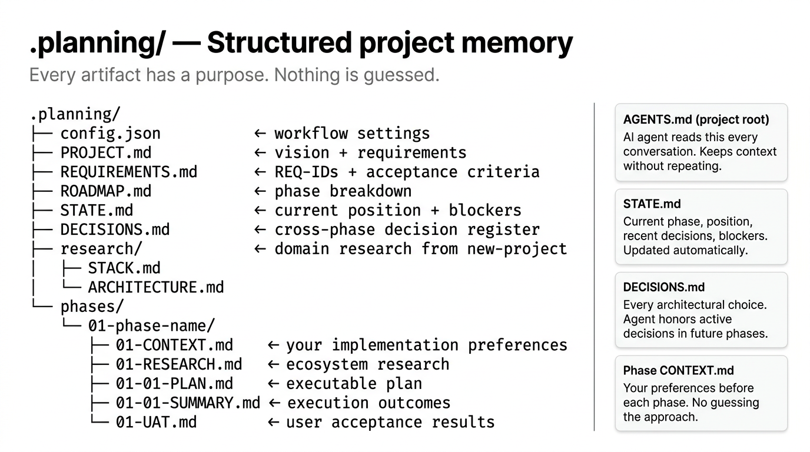

# Planning Artifacts



Every learnship project creates a `.planning/` directory at the project root. These files are the structured memory that keeps the AI agent grounded across sessions, phases, and teammates.

---

## Directory structure

```
.planning/
├── config.json               # Workflow settings (mode, granularity, model profile, etc.)
├── PROJECT.md                # Vision, core value, key decisions summary
├── REQUIREMENTS.md           # REQ-001 … REQ-N with acceptance criteria
├── ROADMAP.md                # Phase breakdown with completion status
├── STATE.md                  # Current position, recent decisions, blockers
├── DECISIONS.md              # Cross-phase architectural decision register
├── KNOWLEDGE.md              # Aggregated lessons (from /knowledge-base)
├── MILESTONE-CONTEXT.md      # Goals + anti-goals (from /discuss-milestone)
├── research/                 # Domain research from /new-project
│   ├── STACK.md              # Technology recommendations
│   ├── FEATURES.md           # Feature breakdown
│   ├── ARCHITECTURE.md       # Structural recommendations
│   ├── PITFALLS.md           # Known risks and gotchas
│   └── SUMMARY.md            # Executive summary of research
├── codebase/                 # Brownfield mapping (from /map-codebase)
│   ├── STACK.md
│   ├── ARCHITECTURE.md
│   ├── CONVENTIONS.md
│   └── CONCERNS.md
├── todos/
│   ├── pending/              # Ideas captured with /add-todo
│   └── done/                 # Completed todos
├── debug/                    # Active debug sessions
│   └── resolved/             # Archived debug sessions
├── quick/
│   └── 001-slug/             # Quick task artifacts
│       ├── 001-PLAN.md
│       ├── 001-SUMMARY.md
│       └── 001-VERIFICATION.md
└── phases/
    └── 01-phase-name/
        ├── 01-CONTEXT.md     # Your implementation preferences (from /discuss-phase)
        ├── 01-DISCOVERY.md   # Unfamiliar area mapping (from /discovery-phase)
        ├── 01-RESEARCH.md    # Ecosystem research findings
        ├── 01-VALIDATION.md  # Test coverage contract (Nyquist)
        ├── 01-01-PLAN.md     # Executable plan: wave 1, plan 1
        ├── 01-02-PLAN.md     # Executable plan: wave 1, plan 2 (independent)
        ├── 01-01-SUMMARY.md  # Execution outcomes
        ├── 01-UAT.md         # User acceptance test results
        └── 01-VERIFICATION.md # Post-execution verification
```

---

## Key files explained

### `AGENTS.md` (project root)

The most important file. Placed at your project root, not in `.planning/`. Your AI platform reads it automatically as a system rule at the start of every conversation.

It contains: project soul and principles, current phase, tech stack, project structure, and a regression log. Updated automatically by workflows as phases advance.

### `STATE.md`

The session continuity file. Contains:
- Current phase and position
- What was last completed
- Active decisions and blockers
- Last session timestamp

Every workflow reads and updates `STATE.md`. If you're ever lost, `/ls` reads this file and tells you exactly where you are.

### `DECISIONS.md`

A structured log of every significant architectural choice made during the project. Each entry records:

```markdown
## DEC-001: [Title]
Date: YYYY-MM-DD | Phase: N | Type: architecture|library|pattern|scope
Context: Why this decision was needed
Options: Option A (pros/cons), Option B (pros/cons)
Choice: Option A
Rationale: Why this was chosen
Consequences: What this locks in or rules out
Status: active | superseded | reverted
```

The planner reads this before every plan creation and never contradicts active decisions. Superseded decisions are kept for history.

### `Phase CONTEXT.md`

Written by `/discuss-phase` before planning. Contains your preferences, constraints, and priorities for this specific phase. The planner reads it as the primary input: your choices override any generic best practices.

### `REQUIREMENTS.md`

Requirements with unique REQ-IDs written during `/new-project`. `/audit-milestone` checks that each REQ-ID has corresponding implementation before release.

---

## Committing planning artifacts

By default, all `.planning/` artifacts are committed to git alongside your code. This gives you:

- A full audit trail of decisions and plans
- The ability to roll back to any prior planning state
- Collaboration: teammates can read `DECISIONS.md` to understand why the code is the way it is

To keep planning artifacts local (private projects, sensitive info):

```json title=".planning/config.json"
{
  "planning": {
    "commit_docs": false
  }
}
```

Add `.planning/` to `.gitignore` and the artifacts stay local.
