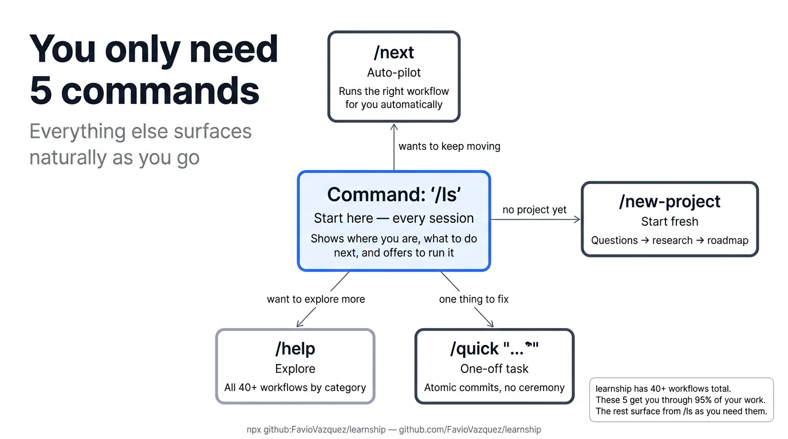

# The 5 Commands



learnship has 42 workflows. You don't need to know them all. Start with these five — everything else surfaces naturally from `/ls` as you need it.

## At a glance

| Command | What it does | When to use |
|---------|-------------|-------------|
| `/ls` | Status + current position + what to do next | **Start every session here** |
| `/next` | Auto-pilot — reads state and runs the right workflow | When you just want to keep moving |
| `/new-project` | Full init: questions → research → requirements → roadmap | Starting a new project |
| `/quick "..."` | One-off task with atomic commits, no planning ceremony | Small fixes, experiments |
| `/help` | All 42 workflows organized by category | Discovering capabilities |

---

## `/ls` — Your home base

```
/ls
```

Run this at the start of every session. It reads your project state and shows:

- Which phase you're in and how far along
- What you were last working on
- The exact next step — and an offer to run it

**New user with no project?** `/ls` explains learnship and offers to run `/new-project`.  
**Returning user?** `/ls` shows your progress and routes you into the right next workflow.

---

## `/next` — Auto-pilot

```
/next
```

Reads your state and immediately runs the correct next workflow without asking. Use this when you trust the state is current and just want to keep moving. Under the hood it calls `/ls` logic then dispatches automatically.

---

## `/new-project` — Start fresh

```
/new-project
```

Walks you through:

1. Structured questions about what you're building
2. Domain research (stack, architecture, pitfalls, ecosystem)
3. Writing `AGENTS.md`, `PROJECT.md`, `REQUIREMENTS.md`
4. Proposing a phase-by-phase roadmap for your approval

After `/new-project`, the AI agent reads `AGENTS.md` every conversation — no more repeating yourself.

---

## `/quick "..."` — One-off tasks

```
/quick "Fix the login button not responding on mobile Safari"
/quick "Add dark mode toggle to the settings page"
/quick --discuss --full "Refactor the auth middleware to support OAuth"
```

Executes a small, atomic task with full guarantees: atomic commits, rollback on failure, optional discussion and verification. No phase planning ceremony.

**Flags:**

| Flag | What it adds |
|------|-------------|
| *(none)* | Minimal: plan → execute → commit |
| `--discuss` | A brief decision conversation before executing |
| `--full` | Full plan + execute + verification pass |

---

## `/help` — Explore everything

```
/help
```

Lists all 42 workflows organized by category with one-line descriptions. Use this when you want to check if a specific capability exists — scope changes, debugging workflows, decision logging, milestone management, and more.

---

## The pattern

```
Session 1:  /new-project        ← create project, approve roadmap
Session 2:  /ls                 ← see where you are
            /discuss-phase 1    ← align on implementation decisions
            /plan-phase 1       ← create executable plans
Session 3:  /ls                 ← resume
            /execute-phase 1    ← build
            /verify-work 1      ← test and fix
Session 4:  /ls                 ← next phase, repeat
```

???+ tip "The golden rule"
    If you're ever unsure what to do next, run `/ls`. It will tell you.
