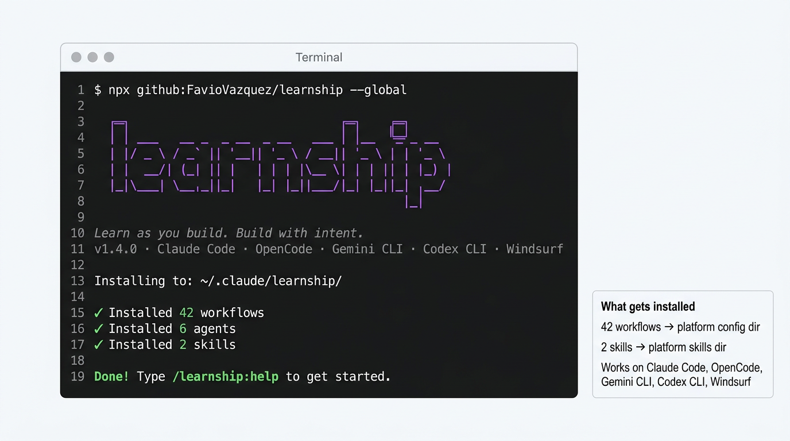

# Installation



learnship installs as a set of workflow files into your AI platform's configuration directory. No daemon, no build step — just markdown files your agent reads.

## Quick install

```bash
npx github:FavioVazquez/learnship
```

The installer auto-detects which platforms are configured on your machine and asks whether to install globally (all projects) or locally (current project only).

## Platform-specific install

=== "Windsurf"

    ```bash
    npx github:FavioVazquez/learnship --windsurf --global
    ```

    Installs to `~/.windsurf/` — workflows available as `/slash-commands` in all Windsurf projects. Native `@agentic-learning` and `@impeccable` skills included.

=== "Claude Code"

    ```bash
    npx github:FavioVazquez/learnship --claude --global
    ```

    Installs to `~/.claude/` — invoke as `/learnship:ls`, `/learnship:new-project`, etc.

=== "OpenCode"

    ```bash
    npx github:FavioVazquez/learnship --opencode --global
    ```

    Installs to `~/.config/opencode/` — invoke as `/learnship-ls`, `/learnship-new-project`, etc.

=== "Gemini CLI"

    ```bash
    npx github:FavioVazquez/learnship --gemini --global
    ```

    Installs to `~/.gemini/` — invoke as `/learnship:ls`, `/learnship:new-project`, etc.

=== "Codex CLI"

    ```bash
    npx github:FavioVazquez/learnship --codex --global
    ```

    Installs to `~/.codex/` — invoke as `$learnship-ls`, `$learnship-new-project`, etc.

=== "All platforms"

    ```bash
    npx github:FavioVazquez/learnship --all --global
    ```

    Installs to every detected platform at once. Recommended if you switch between tools.

## Global vs local

| Flag | Where it installs | Who sees it |
|------|-----------------|-------------|
| `--global` | Platform config dir (`~/.windsurf/`, `~/.claude/`, etc.) | All your projects |
| `--local` | Current project's config dir (`.windsurf/`, `.claude/`, etc.) | This project only |

???+ tip "Recommendation"
    Use `--global` for your primary platform. Use `--local` when you want a specific version pinned to one project or when working in a shared repo where you don't want to affect teammates.

## What gets installed

```
~/.windsurf/              (Windsurf example)
├── workflows/            ← 42 workflow markdown files
│   ├── ls.md
│   ├── new-project.md
│   ├── execute-phase.md
│   └── … 39 more
└── skills/
    ├── agentic-learning/ ← Learning partner skill (native @invoke on Windsurf)
    └── impeccable/       ← Design system skill (18 sub-skills)
```

For non-Windsurf platforms, skills are installed as context files:
```
~/.claude/learnship/
├── workflows/            ← same 42 workflows
└── skills/
    ├── agentic-learning/ ← loaded as AI context
    └── impeccable/       ← loaded as AI context
```

## Verify the install

After installing, open your AI agent and run:

```
/ls
```

You should see either a project status panel (if you're in an existing project) or a welcome message offering to run `/new-project`.

## Updating

```bash
npx github:FavioVazquez/learnship --update
```

Or from inside your AI agent: `/update`

!!! warning "Local customizations"
    If you've edited any workflow files locally, run `/reapply-patches` after updating to restore your changes.
