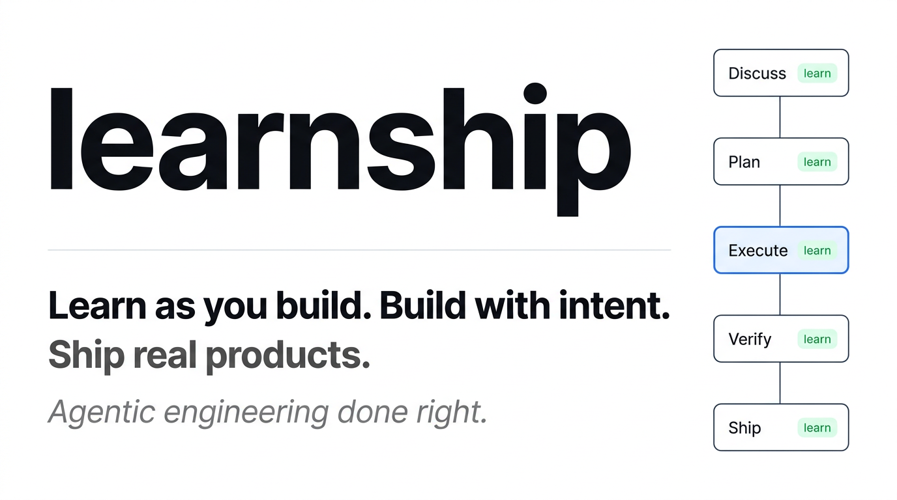

<div class="ls-hero">
  <h1>learnship</h1>
  <p class="ls-tagline">Learn as you build. Build with intent.</p>
  <div class="ls-badges">
    <a href="https://github.com/FavioVazquez/learnship/actions/workflows/ci.yml"></a>
    <a href="https://github.com/FavioVazquez/learnship/releases/latest"></a>
    <a href="platform-guide/windsurf/"></a>
    <a href="workflow-reference/core/"></a>
    <a href="https://github.com/FavioVazquez/learnship/blob/main/LICENSE"></a>
  </div>
</div>



---

## What is learnship?

learnship is an **agent harness** for software engineers — the scaffolding that makes your AI coding agent actually reliable across real projects.

Every serious AI coding tool (Claude Code, Cursor, Manus, Devin) converges on the same architecture: a simple execution loop wraps the model, and the **harness** decides what information reaches the model, when, and how. The model is interchangeable. The harness is the product.

learnship gives you that harness as a portable, open-source layer that runs inside your existing AI tool and adds three things your agent doesn't have by default:

- **Persistent memory** — an `AGENTS.md` file loaded into every session so the agent always knows the project, current phase, tech stack, and past decisions. No more repeating yourself.
- **Structured process** — a repeatable phase loop (Discuss → Plan → Execute → Verify) with spec-driven plans, wave-ordered execution, and UAT-driven verification. The harness controls what context reaches the agent at each step.
- **Built-in learning** — neuroscience-backed checkpoints at every phase transition so you understand what you shipped, not just that you shipped it.

---

## What problem does it solve?

If you've used AI coding assistants for more than a few sessions, you've hit this wall:

> The agent forgets everything. Each session starts from scratch. Decisions get repeated. Code quality drifts. You ship fast but understand less. The more you rely on the AI, the less you own the outcome.

This is a **harness problem**, not a model problem. Research shows the same model on the same benchmark scores 42% with one scaffold and 78% with another. Cursor's lazy context loading cuts token usage by 47%. Vercel deleted 80% of their agent's tools and watched it go from failing to completing tasks. Same model. The only variable is the harness.

learnship solves this with **progressive disclosure** — the pattern that separates working agents from impressive demos. Context is revealed incrementally, not dumped upfront. The right files, decisions, and phase context reach the agent exactly when needed, nothing more.

| Without learnship | With learnship |
|-------------------|----------------|
| Context resets every session | `AGENTS.md` loaded automatically every conversation |
| Ad-hoc prompts, unpredictable results | Spec-driven plans, verifiable deliverables |
| Architectural decisions get forgotten | `DECISIONS.md` tracked and honored by the agent |
| Everything dumped into context at once | Phase-scoped context — only what this step needs |
| You ship code you don't fully understand | Learning checkpoints build real understanding at every step |
| UI looks generic, AI-generated | `impeccable` design system prevents AI aesthetic slop |

---

## Who is it for?

learnship is built for **developers who want to build with AI agents seriously** — not just for quick scripts, but for real products that need to be maintained, understood, and extended.

It's the right tool if:

- You're **building a real project** (not just experimenting) and want the AI to stay aligned across sessions
- You're **learning while building** and want to actually understand what gets shipped
- You care about **code quality and UI quality** beyond "it works"
- You want **parallel agent execution** on Claude Code, OpenCode, or Gemini CLI to ship phases faster
- You've felt the pain of **context loss** — repeating yourself every session, watching the agent forget past decisions

It's probably overkill if you just need one-off scripts or quick fixes — use `/quick` for that.

---

## Install in 30 seconds

```bash
npx github:FavioVazquez/learnship
```

The installer auto-detects your platform. Then open your AI agent and type:

```
/ls
```

That's it. `/ls` tells you where you are, what to do next, and offers to run it.

---

## Three layers that ship real products

<div class="ls-card-grid">
  <div class="ls-card">
    <div class="ls-card-title">⚙️ Workflow Engine</div>
    <p class="ls-card-desc">42 slash commands that take a project from idea to shipped. Spec-driven phases, context-engineered plans, wave-ordered execution, automated verification.</p>
    <span class="ls-card-command">/discuss-phase → /plan-phase → /execute-phase → /verify-work</span>
  </div>
  <div class="ls-card">
    <div class="ls-card-title">🧠 Learning Partner</div>
    <p class="ls-card-desc">Neuroscience-backed checkpoints woven into every phase transition. Active retrieval, spaced review, structured reflection — builds real understanding, not just fluent answers.</p>
    <span class="ls-card-command">@agentic-learning learn · quiz · reflect · space · brainstorm</span>
  </div>
  <div class="ls-card">
    <div class="ls-card-title">🎨 Design System</div>
    <p class="ls-card-desc">17 impeccable steering commands for production-grade UI. Prevent generic AI aesthetics at the source. Based on @pbakaus/impeccable.</p>
    <span class="ls-card-command">/audit · /critique · /polish · /colorize · /animate</span>
  </div>
</div>

---

## Works on 5 platforms

<div class="ls-platform-row">
  <a href="platform-guide/windsurf.md" class="ls-platform-badge native">Windsurf</a>
  <a href="platform-guide/claude-code.md" class="ls-platform-badge">Claude Code</a>
  <a href="platform-guide/opencode.md" class="ls-platform-badge">OpenCode</a>
  <a href="platform-guide/gemini-cli.md" class="ls-platform-badge">Gemini CLI</a>
  <a href="platform-guide/codex-cli.md" class="ls-platform-badge">Codex CLI</a>
</div>

```bash
npx github:FavioVazquez/learnship --all --global   # all platforms at once
```

See the [Platform Guide](platform-guide/windsurf.md) for platform-specific setup and capabilities.

---

## What makes this different


| | Vibe coding | learnship |
|-|------------|-----------|
| **Context** | Resets every session | Engineered into every agent call via `AGENTS.md` |
| **Plans** | Ad-hoc prompts | Spec-driven, verifiable, wave-ordered |
| **Decisions** | Implicit, forgotten | Tracked in `DECISIONS.md`, honored by the agent |
| **Learning** | Incidental | Woven in — retrieval, reflection, spacing at every step |
| **Outcome** | Code you shipped | Code you shipped **and understand** |

---

## Where to go next

<div class="ls-card-grid">
  <a href="getting-started/installation/" class="ls-card">
    <div class="ls-card-title">🚀 Installation</div>
    <p class="ls-card-desc">Platform-specific install commands, global vs local, auto-detection.</p>
  </a>
  <a href="getting-started/first-project/" class="ls-card">
    <div class="ls-card-title">📋 Your First Project</div>
    <p class="ls-card-desc">Walk through new-project → discuss → plan → execute → verify from scratch.</p>
  </a>
  <a href="getting-started/five-commands/" class="ls-card">
    <div class="ls-card-title">⚡ The 5 Commands</div>
    <p class="ls-card-desc">The only commands you need to know to get through 95% of your work.</p>
  </a>
  <a href="skills/agentic-learning/" class="ls-card">
    <div class="ls-card-title">🧠 Learning Partner</div>
    <p class="ls-card-desc">All 11 @agentic-learning actions with when and why to use each.</p>
  </a>
</div>
