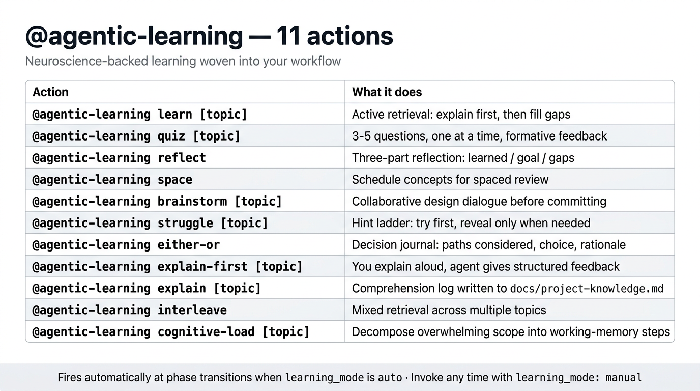
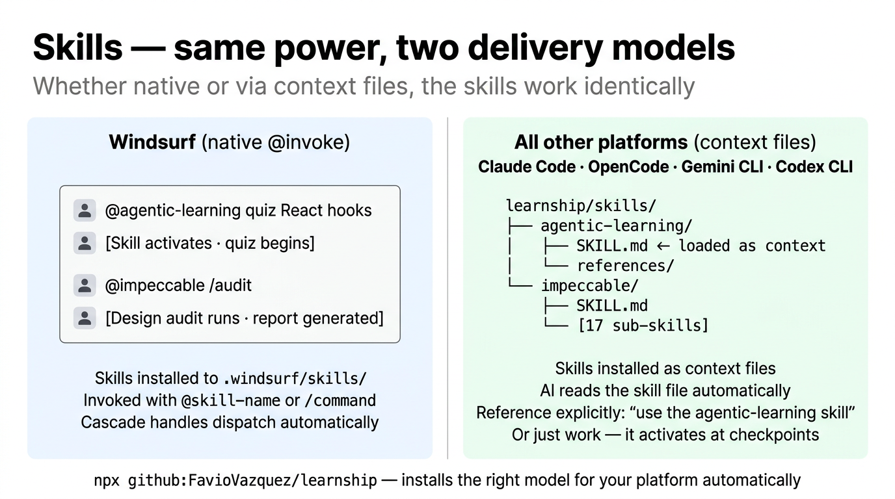

# Learning Partner



The learning partner is woven into learnship, not bolted on. It fires at every phase transition when `learning_mode: "auto"` (the default), offering 2–3 contextually matched actions based on what just happened. You can also invoke any action at any time.

**Core principle:** Fluent answers from an AI are not the same as learning. Every action here makes you do the cognitive work — with support, not shortcuts.

---

## How it activates

```json title=".planning/config.json"
{
  "learning_mode": "auto"    // offered automatically at phase transitions (default)
  "learning_mode": "manual"  // only when you explicitly invoke @agentic-learning
}
```

On Windsurf, skills are natively invoked with `@agentic-learning [action]`.  
On all other platforms, reference the skill explicitly: `use the agentic-learning skill: [action]`.

---

## All 11 actions

### `learn` — Active retrieval

```
@agentic-learning learn [topic]
```

You explain the topic first. The agent listens, then fills gaps with targeted follow-ups. This is deliberate retrieval practice — the most evidence-backed learning technique in cognitive science.

**Best time to use:** After research-phase, after debugging, when a new domain concept was introduced.

---

### `quiz` — Active recall testing

```
@agentic-learning quiz [topic]
```

3–5 questions, one at a time, with formative feedback after each answer. Questions progress from recall to application to synthesis.

**Best time to use:** After execute-phase while implementation is fresh, after research-phase to test domain retention.

---

### `reflect` — Structured reflection

```
@agentic-learning reflect
```

Three-question structured reflection: What did I learn? What was the intent? What gaps remain? Designed to be done in under 5 minutes — short enough to actually do it, rigorous enough to be useful.

**Best time to use:** After execute-phase completes.

---

### `space` — Spaced review scheduling

```
@agentic-learning space
```

Identifies concepts from the current session and schedules them for spaced revisit. Writes a structured review plan to `docs/revisit.md` with suggested review dates based on forgetting curve intervals.

**Best time to use:** After verify-work passes, after pause-work (before ending a session).

---

### `brainstorm` — Collaborative design dialogue

```
@agentic-learning brainstorm [topic]
```

A Socratic design conversation before committing to an approach. The agent asks probing questions, surfaces alternatives you haven't considered, and helps you find blind spots early.

**Best time to use:** After new-project, after discuss-milestone, before locking in a major architecture decision.

---

### `struggle` — Productive struggle with hints

```
@agentic-learning struggle [topic]
```

You attempt to solve a problem from scratch. The agent provides a graduated hint ladder — giving only what you need to keep moving, never the full solution until you've genuinely tried.

**Best time to use:** After debug, after quick (when the task was tricky), when you want to cement a pattern you just used.

---

### `either-or` — Decision journaling

```
@agentic-learning either-or
```

Records the decision paths considered, the choice made, the rationale, and expected consequences. Builds a searchable record of your reasoning that future phases (and future you) can reference.

**Best time to use:** After discuss-phase, after any significant architectural choice, after quick tasks with meaningful design decisions.

---

### `explain-first` — Oracy exercise

```
@agentic-learning explain-first [topic]
```

You explain the concept or approach in your own words before seeing any reference material. The agent gives structured feedback on accuracy, completeness, and gaps.

**Best time to use:** After plan-phase (before executing), after research-phase, any time you want to test understanding before acting on it.

---

### `explain` — Comprehension log

```
@agentic-learning explain [topic]
```

A deeper explanation exercise that writes to `docs/project-knowledge.md` — a persistent log of what you understand about how the project works. Good for onboarding, knowledge transfer, and future reference.

**Best time to use:** After significant phases, before handing off work, when building for future maintainability.

---

### `interleave` — Mixed retrieval

```
@agentic-learning interleave
```

Active recall across multiple topics from different phases or sessions. Interleaving (mixing topics during review) is consistently shown to produce better long-term retention than blocked review.

**Best time to use:** After execute-phase when the phase covered multiple distinct concepts, at the end of a milestone.

---

### `cognitive-load` — Scope decomposition

```
@agentic-learning cognitive-load [topic]
```

Breaks an overwhelming concept or task into working-memory-sized chunks. Uses chunking and progressive disclosure to make large scopes approachable.

**Best time to use:** After plan-phase when the scope feels overwhelming, before tackling a large or complex phase.

---

## Which action when

| Workflow event | Recommended actions |
|---------------|---------------------|
| After `new-project` | `brainstorm` |
| After `discuss-phase` | `either-or` · `brainstorm` · `explain-first` |
| After `research-phase` | `learn` · `explain-first` · `quiz` |
| After `plan-phase` | `explain-first` · `cognitive-load` · `quiz` |
| After `execute-phase` | `reflect` · `quiz` · `interleave` |
| After `verify-work` (pass) | `space` · `quiz` |
| After `verify-work` (bugs found) | `learn` · `space` |
| After `debug` | `learn` · `struggle` · `either-or` |
| After `quick` (tricky task) | `struggle` · `learn` · `either-or` |
| Before `pause-work` | `space` · `reflect` |
| After `resume-work` (long break) | `quiz` · `space` |

---

## Platform availability



| Platform | How it works |
|----------|-------------|
| **Windsurf** | Native skill — invoke with `@agentic-learning [action]`. Cascade dispatches automatically. |
| **Claude Code, OpenCode, Gemini CLI, Codex CLI** | Installed as context files in `learnship/skills/agentic-learning/`. Reference explicitly: `use the agentic-learning skill: [action]`, or just work — it activates at workflow checkpoints automatically. |

---

## The science

The actions in `@agentic-learning` are grounded in established cognitive science:

- **Retrieval practice** (`learn`, `quiz`, `explain-first`) — actively recalling information produces stronger long-term memory than re-reading
- **Spaced repetition** (`space`) — reviewing at increasing intervals exploits the forgetting curve for efficient retention
- **Interleaving** (`interleave`) — mixing topics during practice produces better transfer and discrimination than blocked study
- **Generation effect** (`struggle`) — generating answers (even wrong ones) before seeing the correct answer produces stronger encoding
- **Elaborative interrogation** (`brainstorm`, `either-or`) — explaining why and how strengthens schema formation

Based on [@FavioVazquez/agentic-learn](https://github.com/faviovazquez/agentic-learn).
