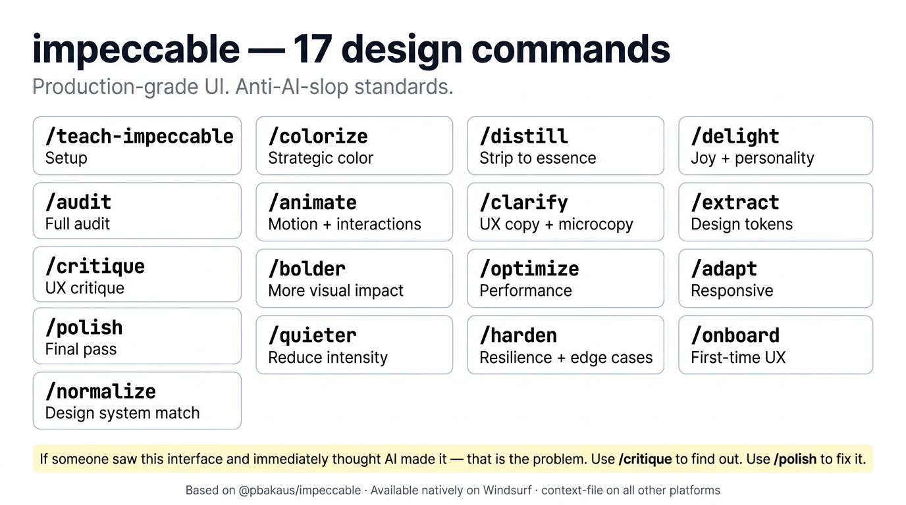

# Design System



**impeccable** is a suite of 17 design steering commands that give your AI agent production-grade UI standards. It prevents generic AI aesthetics — the kind of interface that screams "AI made this" — by providing specific, actionable design direction at every level.

Based on [@pbakaus/impeccable](https://github.com/pbakaus/impeccable).

---

## The AI slop test

Before using any impeccable command, apply this test:

> *If you showed this interface to someone and said "AI made this" — would they believe you immediately?*

If the answer is yes, that's the problem. `/critique` finds out exactly where. `/polish` fixes it.

---

## Setup

Run this once per project before any UI work:

```
/teach-impeccable
```

This gathers your project's design context — brand, target audience, existing UI patterns — and saves persistent guidelines. All subsequent impeccable commands read these guidelines so advice is tailored to your project, not generic.

---

## All 17 commands

### Audit & Assessment

| Command | What it does |
|---------|-------------|
| `/audit` | Comprehensive audit across accessibility, performance, theming, responsive design, and UI consistency. Returns a prioritized issue list. |
| `/critique` | UX critique focused on visual hierarchy, information architecture, user flows, and emotional resonance. Answers "does this feel right?" |

### Quality & Polish

| Command | What it does |
|---------|-------------|
| `/polish` | Final quality pass before shipping — alignment, spacing, consistency, micro-details. The last thing to run before a PR. |
| `/normalize` | Normalize the interface to match your design system. Eliminates inconsistencies in spacing, typography, and component usage. |
| `/harden` | Resilience pass — error states, i18n readiness, text overflow, empty states, edge case handling. |

### Visual Direction

| Command | What it does |
|---------|-------------|
| `/colorize` | Add strategic color to monochromatic or flat interfaces. Applies color with intent — hierarchy, status, emphasis. |
| `/animate` | Add purposeful animations and micro-interactions. Motion that communicates state, not decorates. |
| `/bolder` | Amplify safe or visually timid designs — more impact, stronger hierarchy, clearer intent. |
| `/quieter` | Tone down aggressive or busy designs — reduce visual noise, increase refinement, find the essential signal. |
| `/distill` | Strip to essence. Remove everything that doesn't serve the user's goal. |

### Content & Copy

| Command | What it does |
|---------|-------------|
| `/clarify` | Improve UX copy, error messages, labels, microcopy, and instructional text. Words that work. |

### Performance & Resilience

| Command | What it does |
|---------|-------------|
| `/optimize` | Performance audit and fixes — loading speed, rendering, animation performance, bundle impact. |

### Experience & Delight

| Command | What it does |
|---------|-------------|
| `/delight` | Add moments of joy and personality that make the interface memorable without being distracting. |
| `/onboard` | Design onboarding flows, empty states, first-time user experiences, and progressive disclosure. |

### Systems & Architecture

| Command | What it does |
|---------|-------------|
| `/extract` | Extract reusable components, design tokens, and patterns from one-off implementations into your design system. |
| `/adapt` | Adapt designs across screen sizes, devices, input methods, and usage contexts. |

---

## Typical usage flow

```
/teach-impeccable          # once per project

# During development
/audit                     # find issues
/colorize                  # add visual hierarchy
/clarify                   # fix the copy

# Before shipping
/harden                    # edge cases and resilience
/polish                    # final alignment and consistency
/critique                  # honest UX assessment
```

---

## Platform availability

| Platform | How it works |
|----------|-------------|
| **Windsurf** | Native skills — each command is a dedicated skill file. Invoke directly: `/audit`, `/polish`, `/critique`, etc. Cascade dispatches to the right sub-skill. |
| **Claude Code, OpenCode, Gemini CLI, Codex CLI** | Installed as context files in `learnship/skills/impeccable/`. Reference explicitly: `run the /audit impeccable skill`, or just ask for UI work and the agent applies the standards automatically from the context files. |

---

## Anti-patterns impeccable prevents

These are the most common signs of AI-generated UI that impeccable is specifically designed to eliminate:

- **Aggressive blue primary color** on everything with no hierarchy
- **Cards with shadows everywhere** regardless of elevation intent
- **Form fields with excessive padding** that wastes space
- **Generic empty states** that say "No data found" with a sad icon
- **Animations that use `ease-in-out` for everything** without matching the interaction type
- **Color that decorates** rather than communicates state or hierarchy
- **Typography with no rhythm** — inconsistent line heights, arbitrary font sizes
- **Mobile designs that are just desktop scaled down** — no real touch target consideration

Run `/critique` to find these. Run the targeted commands to fix them.
