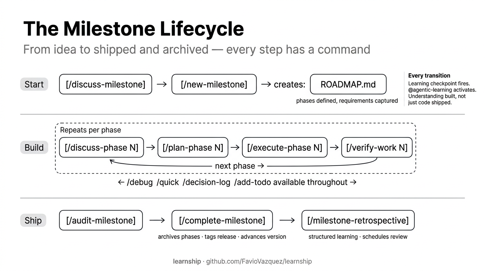

# Core Workflow

These 8 workflows form the backbone of every learnship project. They take you from zero to shipped.



---

## `/new-project`

Initializes a new project with full spec-driven scaffolding.

**What it does:**
1. Structured questioning about what you're building, why, and for whom
2. Domain research — stack recommendations, architecture patterns, pitfalls
3. Writes `AGENTS.md`, `.planning/PROJECT.md`, `.planning/REQUIREMENTS.md`
4. Proposes a phase-by-phase `ROADMAP.md` for your approval

**When to use:** Start of any new project, greenfield or brownfield (after `/map-codebase`).

**Learning checkpoint:** `@agentic-learning brainstorm [topic]` — surface blind spots before planning starts.

---

## `/discuss-phase [N]`

Captures implementation decisions for phase N before any planning begins.

**What it does:**
1. Reads your roadmap and prior `DECISIONS.md`
2. Asks targeted questions about your preferences for this phase
3. Writes `.planning/phases/N-*/N-CONTEXT.md` — the planner's primary input

**When to use:** Before every `/plan-phase`. Skipping this is the #1 source of misaligned plans.

**Learning checkpoint:** `either-or` · `brainstorm` · `explain-first`

---

## `/plan-phase [N]`

Researches the domain and creates executable plans for phase N.

**What it does:**
1. Reads `CONTEXT.md`, `DECISIONS.md`, and `AGENTS.md`
2. Runs domain research if `workflow.research: true`
3. Creates 2–4 `PLAN.md` files, each scoped to one coherent area
4. Runs a verification loop (up to 3 passes) checking for gaps

**Output:** `.planning/phases/N-*/N-01-PLAN.md`, `N-02-PLAN.md`, etc.

**When to use:** After `/discuss-phase N` is complete.

**Learning checkpoint:** `explain-first` · `cognitive-load` · `quiz`

---

## `/execute-phase [N]`

Executes all plans for phase N in wave order with atomic commits.

**What it does:**
1. Reads all `PLAN.md` files for the phase
2. Groups plans into waves (independent plans → same wave, dependent → next wave)
3. Executes each task with an atomic git commit
4. Writes `SUMMARY.md` for each plan

**When to use:** After `/plan-phase N` is complete.

**Parallel option:** Set `"parallelization": true` to dispatch each plan to its own subagent (Claude Code, OpenCode, Gemini CLI, Codex CLI).

**Learning checkpoint:** `reflect` · `quiz` · `interleave`

---

## `/verify-work [N]`

Manual UAT for phase N with agent-assisted diagnosis and fix planning.

**What it does:**
1. Shows what was built and the acceptance criteria
2. You test it manually
3. You report any issues in plain language
4. Agent diagnoses root causes and creates targeted fix plans
5. You execute fixes and re-verify

**When to use:** After `/execute-phase N` completes.

**Learning checkpoint:**
- Pass: `space` · `quiz`
- Bugs found: `learn` · `space`

---

## `/audit-milestone`

Pre-release quality gate — requirement coverage, stub detection, integration check.

**What it does:**
1. Maps every REQ-ID from `REQUIREMENTS.md` to implementation
2. Scans for stubs, placeholders, and TODO markers
3. Checks integration between phases
4. Reports coverage gaps as a prioritized list

**When to use:** Before `/complete-milestone`. Don't skip this.

---

## `/complete-milestone`

Archives the milestone, creates a git tag, and advances the project to the next cycle.

**What it does:**
1. Archives all phase artifacts to `.planning/milestones/`
2. Writes a milestone summary
3. Creates a git tag (`v[version]`)
4. Advances `STATE.md` and `AGENTS.md` to the next milestone

**When to use:** After all phases are verified and `/audit-milestone` passes.

---

## `/new-milestone [name]`

Starts a new milestone version cycle.

**What it does:**
1. Reads the completed milestone's summary
2. Asks questions about the next milestone's goals (or reads `MILESTONE-CONTEXT.md` if present)
3. Creates a new `ROADMAP.md` for the next cycle

**When to use:** After `/complete-milestone`. Run `/discuss-milestone` first for better results.

**Learning checkpoint:** `brainstorm [milestone topic]`

---

## Common patterns

```bash
# Standard phase lifecycle
/discuss-phase N → /plan-phase N → /execute-phase N → /verify-work N

# With explicit review before executing
/discuss-phase N
/plan-phase N
/list-phase-assumptions N    # preview the plan approach before committing
/execute-phase N

# Brownfield start
/map-codebase
/new-project                  # questions focus on what you're ADDING
# normal phase lifecycle
```
