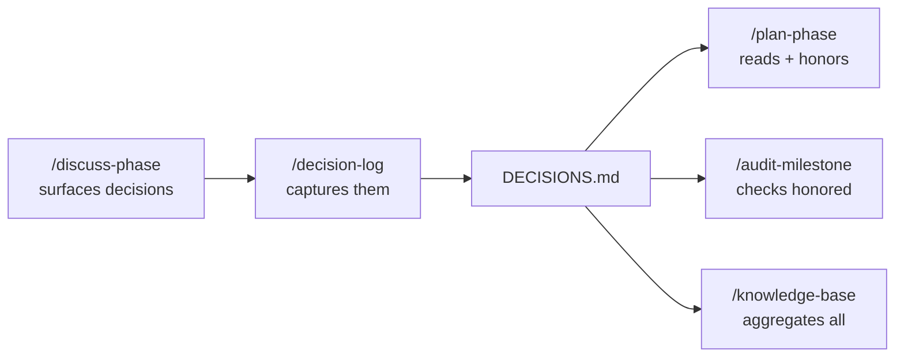

# Decision Intelligence

Every project accumulates decisions — architecture choices, library picks, scope trade-offs. These workflows track them so future sessions, phases, and teammates understand *why* the project is built the way it is.

---

## `/decision-log "[description]"`

Captures a significant decision with full context, alternatives considered, and rationale.

```bash
/decision-log "Using Zustand over Redux for state management"
/decision-log "Chose PostgreSQL over MongoDB for primary storage"
```

**What it writes to `DECISIONS.md`:**

```markdown
## DEC-001: Use Zustand over Redux
Date: 2026-03-01 | Phase: 2 | Type: library
Context: Needed client-side state for dashboard filters
Options: Zustand (simple, no boilerplate), Redux (complex, overkill)
Choice: Zustand
Rationale: 3x less boilerplate, sufficient for current data flow
Consequences: Locks React as UI framework
Status: active
```

**When to use:** After any significant architectural choice, during or after `/discuss-phase`, or any time a decision is made that will affect future phases.

Decisions are automatically read by:
- `/plan-phase` — planner never contradicts active decisions
- `/audit-milestone` — checks decisions were honored in implementation
- `/knowledge-base` — aggregated into a searchable knowledge file

---

## `/knowledge-base`

Aggregates all decisions, lessons, and key findings from across all sessions into a single searchable `KNOWLEDGE.md`.

```bash
/knowledge-base              # build/update the knowledge base
/knowledge-base search [query]  # search for a specific decision or lesson
```

**What it aggregates:**
- All entries from `DECISIONS.md`
- Key lessons from phase `SUMMARY.md` files
- Bug patterns from `debug/resolved/` sessions
- Research findings from `research/` and per-phase `RESEARCH.md` files

**When to use:** Before starting a new milestone (to ensure all prior knowledge is captured), before onboarding a new team member, when you need to recall why something was built a certain way.

---

## `/discuss-milestone "[version]"`

Captures milestone-level goals, anti-goals, and constraints before `/new-milestone` starts.

```bash
/discuss-milestone v2.0
```

**What it produces:** `.planning/MILESTONE-CONTEXT.md` — a structured document that `/new-milestone` reads automatically to skip re-asking.

**The most valuable part — anti-goals:**

```markdown
## Anti-Goals
- Don't touch the auth system — it's in use by paying customers
- Don't add real-time features — that's v3
- Don't change the public API shape — clients depend on it
```

Anti-goals are often more valuable than goals. They bound the scope before planning starts.

**When to use:** Before every `/new-milestone`. The discussion takes 10 minutes and prevents scope creep for the entire milestone.

**Learning checkpoint:** `brainstorm [milestone topic]` — surface alternatives and blind spots before committing to a direction.

---

## The decision flow



---

## Best practices

- **Log decisions when made**, not retroactively — context fades fast
- **Include alternatives** — the options you *didn't* choose are as important as the one you did
- **Mark superseded decisions** — when an active decision is overridden, update its status to `superseded` and log the new decision with a reference to the old one
- **Run `/knowledge-base`** before each new milestone to consolidate everything into a single queryable document
